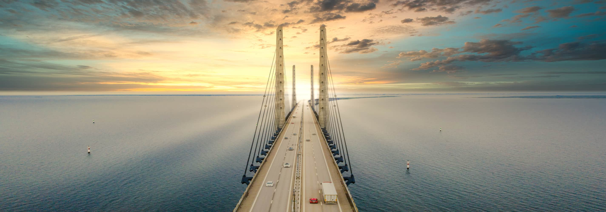
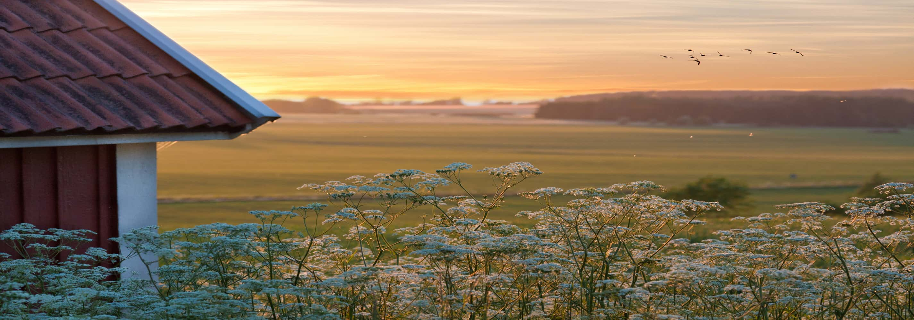
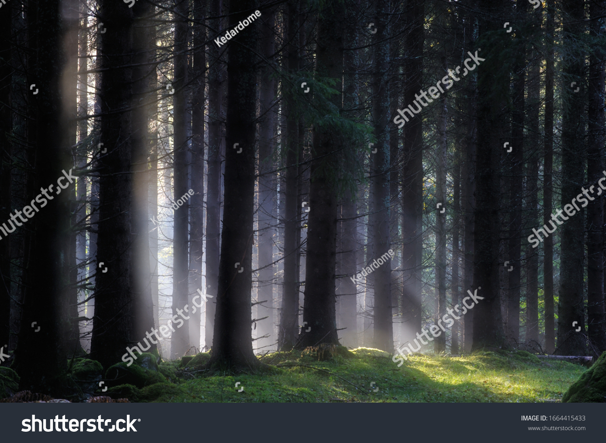
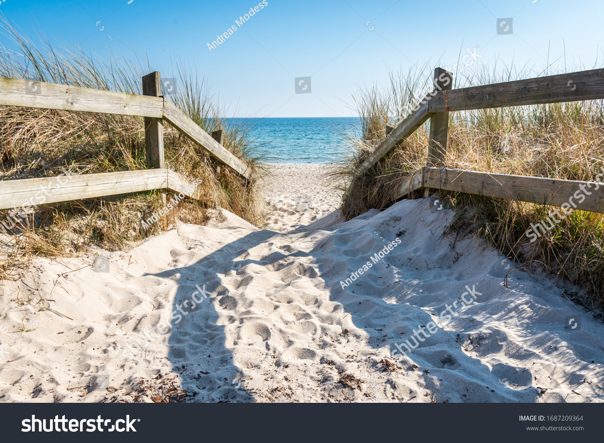
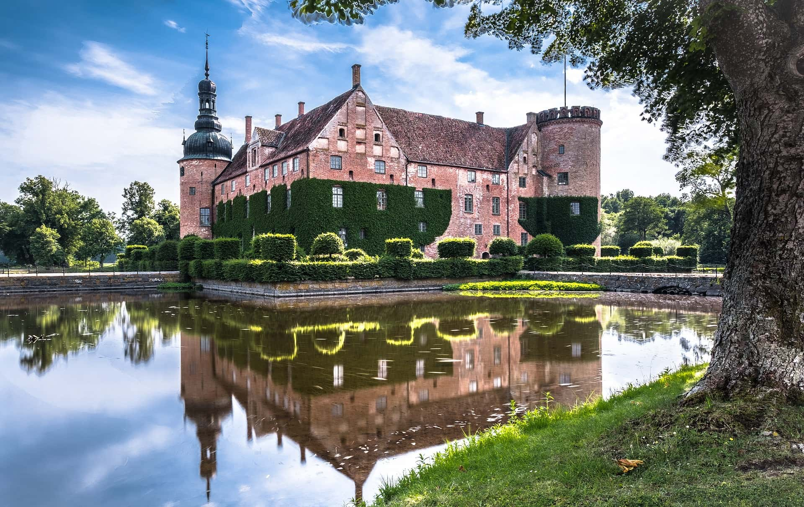
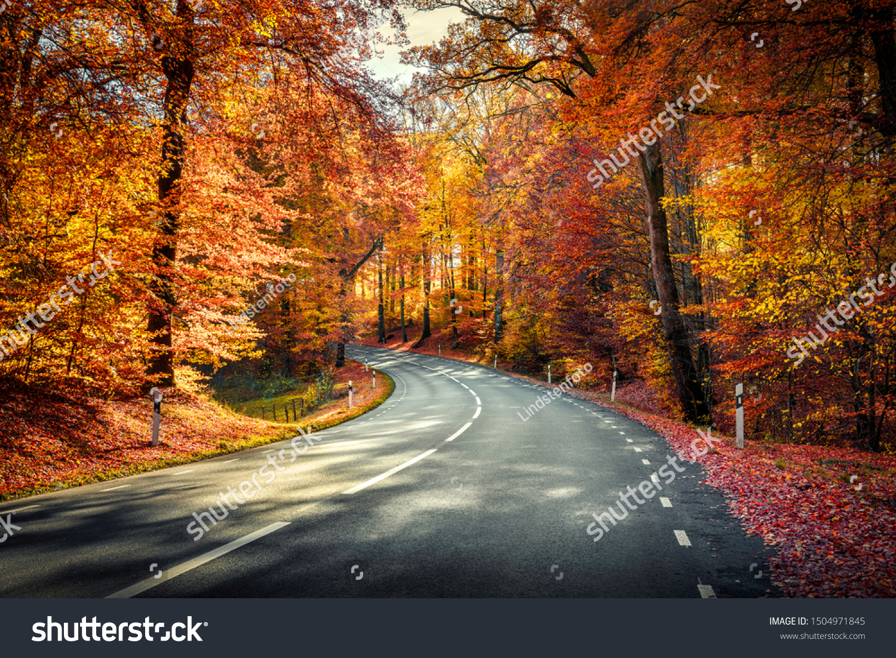
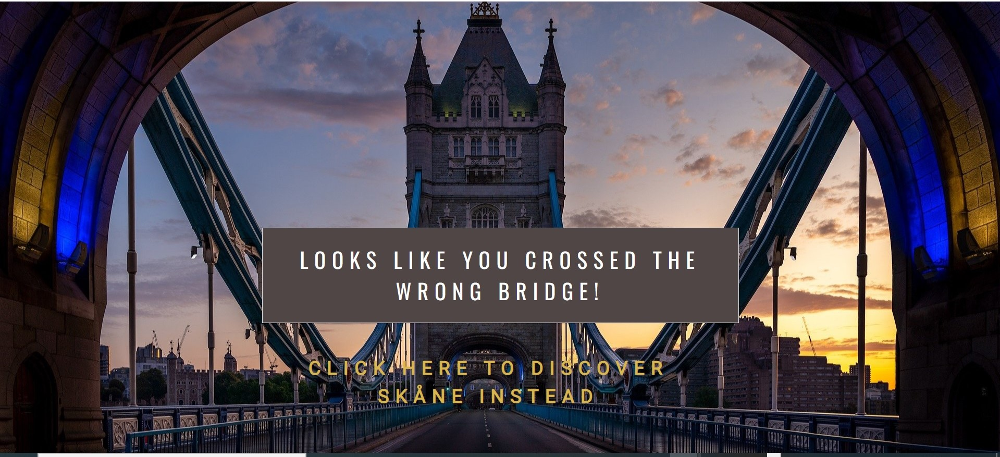
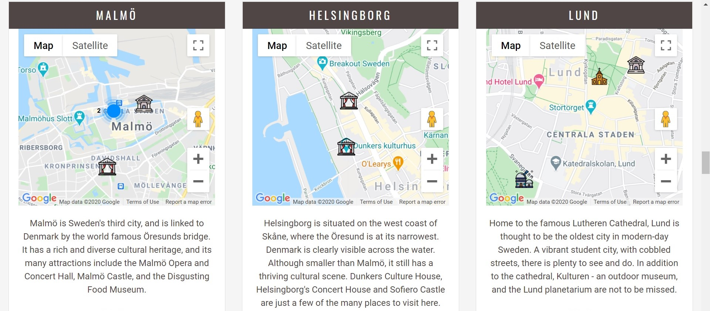
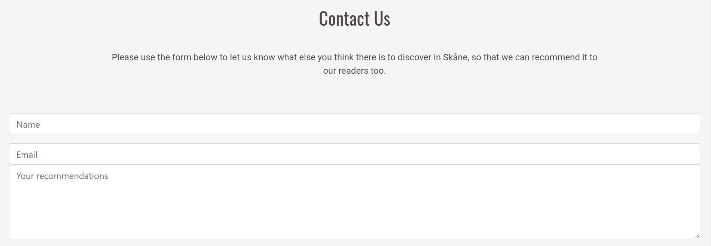
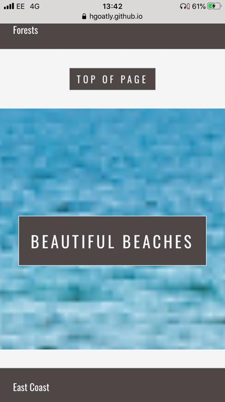

    
    
    
# **A tourist website that showcases the region of Skåne in Southern Sweden**

Built using [GitHub Pages](https://pages.github.com/).
Click here to [Discover Skåne](https://hgoatly.github.io/Discover-Skane/).

# **Table of Contents:**

- [Site Owner Goals](#site-owner-goals)
- [User Experience (UX)](#user-experience--ux)
  - [User Stories](#user-stories)
    - [First Time Visitor Goals](#first-time-visitor-goals)
    - [Returning Visitor Goals](#returning-visitor-goals)
    - [Frequent Visitor Goals](#frequent-visitor-goals)
  - [Design](#Design)
    - [Colours Used](#colours-used)
    - [Typography](#typography) 
    - [Imagery](#imagery)
    - [Layout](#layout)
    - [Wireframes](#wireframes)
  - [Features](#features)
    - [Mobile Design Features](#mobile-design-features)
    - [Tablet Design Features](#tablet-design-features)
    - [Desktop Design Features](#desktop-design-features)
    - [How The Features Relate To The User Stories](#how-the-features-relate-to-the-user-stories)
    - [Future Features](#future-features)
- [Technologies Used](#technologies-used)
  - [Languages Used](#languages-used)
  - [Frameworks, Libraries and Other Sources Used](#frameworks,-libraries-and-other-sources-used)
  - [Application Programming Interfaces Used (APIs)](#application-programming-interfaces-used-(APIs))
- [Testing](#testing)
  - [Known Bugs and Fixes](#known-bugs-and-fixes)
- [Deployment](#deployment)
  - [Github Pages](#github-pages)
  - [Forking The Repository](#forking-the-repository)
  - [Making A Local Clone](#making-a-local-clone)
- [Credits](#credits)
- [Version Control](#version-control)

## Site Owner Goals:

Discover Skåne is a tourist site showcasing the different types of holidays available in the county of Skåne, in Southern Sweden.
It is primarily an informative website. The site has two main objectives.

1. To provide information about the types of holiday activites available in Skåne for people who have already booked holidays there.

2. To showcase the different holiday activities available in Skåne to people who are looking to choose a holiday destination, 
in order for them to be able to make a hotel booking through the site.

It uses Google Maps API to pinpoint places of interest within the county, Booking.com Partner Centre 'Deal Finder' API as well as email.js
API in order to add interactivity to the site. 

The site can be viewed in both the English and Swedish languages.

The site is based on a one page layout with six distinct sections, plus an additional 'landing page'.
The first three sections are mainly informative, with interactivity provided by map elements. They are based around the different types of holiday that one can take in the Swedish county of Skåne.

The sections are as follows:

1. Lakes and Forests.
2. Beautiful Beaches.
3. City and Culture. 

Each of these three sections has three card elements with a picture on the front, and a map on the back. The text below talks about recommended places based 
on the theme of the card, for example, the text on the 'Lakes' card talks about recommended lakes to visit in Skåne. Below this, the user has the option to click on the text
that says 'Show on Map'. When clicked, this reveals the map specific to the that particular card. On the map, the recommended places to visit are 
marked on the map with a custom marker, which is also specific to the theme of the card. When the marker is clicked, an infowindow appears, which displays the name of the location, some information about
the location, and the attribution - which is also a link to an external site from where the text for the infowindow was sourced, and where the site visitor can 
can learn more about the destination. 

The next section is the map section - which is both informative and interactive.
On the map, all of the markers from the 'Lakes and Forests', 'Beautiful Beaches' and 'City and Culture' sections are displayed, along with their infowindows.
As the map covers a larger area, and is less localised there are also additional custom markers for the cities of 'Malmö', 'Helsingborg' and 'Lund', with infowindows that display information in the 
same format as the other custom markers. 
Additionally, there is a 'search box' where the user can search the map for additional places of interest that are not already listed on the site. 

The final two sections are mainly interactive. They are as follows:

1. Book.
2. Contact.

The 'Book' section uses the [Booking.com](https://www.booking.com/affiliate-program/v2/index.html?utm_source=&utm_campaign=&utm_content=&utm_term=&utm_medium=) affiliate partner program API,
so that after having chosen their ideal holidays in Skåne, visitors to the site can book their stay. Out of the available booking.com APIs, it was decided that the 'Deal Fider' API was the most appropriate.
This is because it not only shows images, but also because the search area can be restricted to Skåne. The other options either had no images, or would search the whole of Sweden - which the developer thought 
would be confusing for the site visitor. 

The 'contact' section encourages the user to contact the site owner via a contact form. This is so they can suggest places that could also be listed on the 'Discover Skåne' website as additional recommendations to site users. It uses the email.js API 

## User Experience (UX):

### User Stories:

To find out how the features relate to the User Stories, jump to [How The Features Relate To The User Stories](#how-the-features-relate-to-the-user-stories).

1. I have booked a holiday to Skåne, and I want to find out where there is a lake, so that I can go fishing.
2. I have booked a holiday to Skåne, and I want to find out where there is a lake, so that I can go canoeing.
3. I have booked a holiday to Skåne, and I want to find out where there is a lake, so that I can enjoy the landscape and see some waterfoul.
4. I have booked a holiday to Skåne, and I want to find out where there are some unspoilt forests and National Parks, so that I can enjoy getting back to nature.
5. I have booked a holiday to Skåne, and I want to find out where there are some beaches, so that I can enjoy a seaside break.
6. I have booked a holiday to Skåne, and I want to find out where there are some cultural activities available, so that I can learn/see something new.
7. I want to find out whether there are any nice beaches in Skåne, so that I know whether to book a beach holiday there.
8. I want find out whether there are any unspoilt forests in Skåne, so that I know whether to book a holiday there where I can 'get away from it all'. 
9. I want to know where there are some nice lakes in Skåne, so that I know whether to book a holiday there. 
10. I want to know what kind of cultural activities there are in the largest cities in Skåne, so that I know whether to book a city break there.
11. I want to find some hotel deals, so that I can book my holiday in Skåne.
12. I want to view all the recommended places to visit in Skåne on one map, so that I know where they all are in relation to one another. I also want to be able to
search the map to find additional locations.
13. I want to get in touch with the site owner so that I can recommend more places to visit in Skåne.

### First Time Visitor Goals:

- To easily find out the main purpose of the site. 
- To easily find out what the county of Skåne has to offer as a holiday destination.
- To easily navigate around the site to find relevant content.
- To easily be able to find points of interest on a map. 

### Returning Visitor Goals: 

- To find out if any new content has been added for subsequent visits to Skåne.
- To contact the site owner to let them know about any places to visit in Skåne that they would like to recommend.

### Frequent Visitor Goals: 

- To find out whether any new content has been added for subsequent visits to Skåne.
- To find out about different holiday options from those that the site visitor has already experienced.

### Design: 

- **Landing Page:** The idea of the 'Discover Skåne' landing page is to invite the site visitor to enter the main site. The hero image is 
a picture of the famous Öresunds Bridge, that connects the Swedish county of Skåne to Denmark. Superimposed on the image is the site logo 
and an 'Enter' button, that invites the user to click on it and enter the site - which is a visual metaphor for how they would 'Discover Skåne' by crossing the bridge physically.

- **Main content:** Once the 'Enter' button has been clicked, the page disappears, and the user is taken to the main content.

- **Navbar:** The 'Main Content' page has a fixed navbar at the top of the page. The decision was made not to display the logo on the navbar for two reasons. 
Firstly, the logo is clearly displayed on further down the page, and secondly, as the page is one page with different sections, there is no need to have
a logo element that navigates back to the home page. All of the sections of the page are listed as links on the navbar, as well as a flag icon - which toggles the language of the content 
from English to Swedish.

- **Hero Image:** Below the navbar, the hero image is found, upon which the 'Discover Skåne' logo in superimposed. 

- **Six Main Sections:** The six sections found below the hero image are as detailed in the 'Site Owners Goals' section.

- **404 Error Page:** A custom 404 error page has been designed in order to help the user find their way back to the site in the event of a 404 error.

- **Favicon:** A favicon of the Skåne flag has been created for the site, so that the appropriate tab is clearly visible in the user's browser.

### Colours Used:

- **Site Logo and Section Titles:** The colour #4f4646, which is brown/grey, was chosen as the background colour, as it has a neutral, but somewhat 'Scandinavian' feel to it. It is also a 
good colour match with all of the images used throughout the site. The text colour is #fff (white) as it makes a good contrast with the background, and makes the text easy to read.

- **Enter Button:** The Skåne flag is a yellow cross on a red background. #dc3545 (red) was chosen for the background of the enter button, and #d8b54d (yellow) was chosen
for the text in order to represent the Skåne flag.  Whilst this yellow is perhaps not as bright as the colour on the Skåne flag, it was chosen because text written in a 
brighter yellow was more difficult to read against the background colours used on the site. On a desktop, when the button is hovered over, the text colour changes to white. This is a visual metaphor for crossing the
bridge into Skåne, as the Danish flag is a white cross on a red background. It is representative of what the picture suggests: that you are leaving Denmark to enter Skåne.

- **Navbar and Footer, Card Headers and 'Top of Page' Button:** The background colour of each of these elements is #4f4646, and the text colour is #fff. It was deliberately decided that they should be the same colours as on the 
logo, to create a colour theme for the site. The 'Show on Map' and 'Hide Map' text (and their Swedish equivalents) is black (#212529) in order to stand out a little more than the rest of the text on the card. 

- **Cards:** #fff was chosen as the background for the card elements, in order to make a good contrast with the text, for which the colour #4f4646 was chosen as it fits well with the general colour theme of the site.

- **Site Background:** The colour #f5f5f5 (off-white) was chosen as the background colour for the whole site. This is because it fits well with the general colour theme of the site, but also provides a subtle, yet distinct, contrast with 
the card elements, which have a background colour of #fff (white). 

- **Infowindows:** The colour #dc3545 (red) was chosen for the name of the location inside each infowindow. The colour for the 'Attribution' link is #d8b54d (yellow). This was in order to match the colours of the Skåne flag.
The background colour of the infowindows is #fff, and the text is #4f4646 in order to match the background and text colours on the rest of the card. These colours are the same on the infowindows on the main map in order to create consistency

- **404-Error-Page** As for the Site Logo and section titles, the colour #4f4646 was used as the background colour for the error text. Below this, the colour #d8b54d was used for the link. On hover, this changes to #dc3545 on hover. The colours 
were chosen in order to match the Skåne flag, and to stand out against the background. 

- **Social Links:** The colour of the social links was chosen to be #d8b54d (yellow). On hover, the links turn red: #dc3545 (red). This was in order for the colours to match the Skåne flag, like elsewhere on the site, and to stand out against the background.

### Typography:

- 'Oswald' was chosen as the font for all of the Section Titles, with a fallback of 'cursive' - in case the 'Oswald' font fails to load. 
It was chosen as it it both bold and stylish - whilst able to be easily read.
- 'Roboto' was chosen as the font for the rest of the text, with a fallback of 'sans-serif' in case the 'Roboto font doesn't load. Roboto is 
clean and easy to read, which makes it an appropriate font for the text.

### Imagery:

- Images of Skåne were chosen for the site that were considered to be both striking, and appropriate for their context. 

- The landing page image was chosen as a visual metaphor for entering Skåne via the famous Öresund bridge.  

- Other appropriate images were chosen to represent different sections:

- A picture of a beautiful meadow in the Skåne countryside was chosen as the hero image on the 'Main Content' page, with the site logo superimposed on it.
    
    

- A picture of a pine forest was chosen for the 'Lakes and Forests' section header.

       

- A picture of a beach in Skåne was chosen for the 'Beautiful Beaches' section.

- A picture of a castle in Skåne was chosen for the 'City and Culture' section. 

- A picutre of a road in Skåne was chosen for the 'Map' section.

- The images of the hotel room, and of hands on a computer were not pictures that were taken 
in Skåne, but were more metaphorical in nature, and chosen to represent the 'Book' and 'Contact' 
sections respectively, as they are descriptive images that represent the content of their respective sections well.

- 'Book' Header Image:

- 'Contact' Header Image:

- The 404 Error page features an image of Tower Bridge in London. It is a visual metaphor to let the user know that they are definitely in the wrong place. 
By featuring completely the wrong bridge, the idea is to keep the page lighthearted, but in the same style as the Landing Page. Sabina Plimmer on [LCN.com](https://www.lcn.com/blog/beginners-guide-custom-404-pages/)
states: 'Try to keep it light-hearted. Remember, one of the primary reasons why we’re creating a custom 404 page is to replace the blunt and annoying “page cannot be displayed” 
message with something which is less likely to chase away visitors.' This is what the Discover Skåne 404 Error page is trying to acheive. The text on the mobile version
has been changed to: "Wrong Bridge! Discover Skåne instead", so that it will fit on the screen better. 

### Layout: 

- The Bootstrap framework was used throughout the site to add responsiveness and to help facilitate mobile-first design.
- The website is designed around a one page layout, so that site visitors can easily find the information they are looking for in one place.

### Wireframes: 

- The final Wireframes for this project can be viewed <a href="assets/wireframes/discover-skane.pdf" target="_blank">here.</a>
- Original Wireframes can be seen <a href="assets/wireframes/discover-skane-original-wireframes.pdf" target="_blank">here.</a>
- The decision was made to change the orignal design from having a carousel of images to having a single image because of 
accessability concerns. 
- In the original design, both the 'Book' and 'Contact' section appear in modals, rather in the body of the page. 
The decision not to have them in modals, and in their own sections on the main page instead was 
taken on the advice of my mentor. The final design works better as now the modals do not break up the flow of the page.

## Features: 

'Discover Skåne' is built to be resonsive, on the principles of mobile-first design. The Bootstrap Grid System has helped 
facilitate this. With this in mind, there are some differences between the Mobile, Tablet and Desktop versions. All versions 
of the site have a fixed navbar and footer, with a 'scroll to top' button at the bottom of each section, which allows for the 
navbar to be easily accessed from wherever you are on the page.

### Mobile Design Features: 

The main features of the mobile version of the 'Discover Skåne' website are detailed below:

- The navbar has been collapsed, and is accessed by clicking on the 'hamburger' icon in the top left hand corner.

- The images have been reduced in size, so that they are appropriate for a mobile screen, and so that they load quickly.

- All of the card elements have been collapsed into 'accordions', whereby each collapsed element needs to be clicked on in 
order to be viewed. Only one card is visible at a time, as multiple cards next to each other would have been inappropriate for 
the screen size. The decision to collapse the card elements was made to provide better UX, as otherwise the site visitor would 
have to scroll past too much content, and it would have been poor UX.

- A pseudo parallax feature has been added to the page in order to make it visually appealing. It is a pseudo parallax rather than a 
true parallax, as the background images are static, rather than moving at a different speed from the content that scrolls past it. It
has, however, been disabled on iOS devices, as the following CSS is not supported by ios: "background-attachment: fixed;". 
A media query was used to detect the iOS operating system, and to set: "background-attchment: scroll;" in this case.

### Tablet Design Features:

The tablet design was designed for screens no wider than 991 pixels, and has the same features as the mobile version, except those 
detailed below. On screens wider than 991 pixels, the desktop version will be used.

- In the first three sections, are only two card elements displayed rather than three, as the images looked squashed when there were three of them. Rather than 
being collapsed into an accordion, they are displayed next to each other as this is more visually appealing.

- Like on the mobile version, the parallax feature has been disabled on tablets running iOS, because iOS does not support: "background-attachment: fixed;".

### Desktop Design Features:

The desktop design was designed for screens wider than 991 pixels, and has some of the same features as the mobile and tablet versions.The differences are detailed below:

- The fixed navbar is not collapsed, and spans the width of the page.

- Each of the first three 'informative' sections contains a Bootstrap card-deck. Each card-deck displays three cards next to one another in a way that 
is designed to be visually appealing. None of the content is collapsed.

- The images are an appropriate size for the screen size.

### How the Features Relate to the User Stories:

1. User Stories 1, 2, 3 and 9 are concerned with finding a lake to suit a specific purposes. The 'Lakes and Forests' section details recommended lakes in Skåne, and displays them on a map 
with custom markers. Each custom marker has an infowindow that displays more information about each lake.
The same lakes are also displayed on the main map in the 'Map' section of the page.

- Screenshot of the Lakes Card with image displayed.

- Screenshot of the Lakes card with the map diplayed.

- Screenshot of the Lakes card with the map displayed, and the Hjälmsjön infowindow open.

- Screenshot of the Lakes card with the map displayed, and the Lake Immeln infowindow open

- Screenshot of the Lakes card with the map displayed, and the Hammarsjön infowindow open

2. User Stories 4 and 8 are concerned with finding a forest or National Park. The 'Lakes and Forests' section details recommended forests and national parks, and displays them on maps with custom markers.
Each custom marker has an infowindow that displays more information about the forest, and a link that takes the user to an external site that can be visited to find out more about the destination.
Screenshots of the infowindows can be viewed in the [testing.md](testing.md) file.
The same forests and National Parks are displayed on the main map in the 'Map' section.

- Screenshot of the National Parks card with the image displayed.

- Screenshot of the National Parks card with the map displayed.

- Screenshot of the Forests card with the image displayed.

- Screenshot of the Forests card with the map displayed.

3. User Stories 5 and 7 are concerned with finding beaches in Skåne. The 'Beautiful Beaches' section details recommended beaches in 3 regions of Skane, and displays them on a series of 
maps with custom markers. The same markers are displayed on the main map section of the page. In the image below, some of the beach markers are displayed in a marker cluster due to their proximity to 
one another. Screenshots of the infowindows can be found in the [testing.md](testing.md) file.

- Screenshot of the Beautiful Beaches cards with the images displayed.

- Screenshot of the Beautiful Beaches cards with the maps displayed.

4. User Stories 6 and 10 are concerned with finding cultural activities in Skåne. The 'City and Culture' section details recommended cultural activites in the cities of Malmö, Helsingborg and Lund, 
and displays them on a series of maps with custom markers. Usually, the custom markers display as marker clusters on these maps. In these images, the zoom level of the maps has been changed so that
some of the custom markers are visible. Screenshots of the infowindows can be found in the [testing.md](testing.md) file.

- Screenshot of the City and Culture cards with the images displayed.

- Screenshot of the City and Culture cards with the maps displayed.

5. User Story 11 is concerned with being able to book a holiday to Skåne. The 'Book' section uses the Booking.com partner centre 'Deal Finder' API to allow people to book somewhere to stay. 

- Screenshot of the Booking.com deal finder API embedded on the page.

6. User Story 12 is concerned with being able to see all of the recommended places on one map, and to be able to search for additional locations on the map. 
The 'Map' section uses the Google maps API to show all of the recommended places in Skåne on map, with custom markers. It also has a search box.

- Screenshot of the main map (Google Maps API) embedded on the page.

7. User Story 13 is concerned with being able to contact the site owner, in order to be able to suggest more places that could be featured on the site. The 'Book' section uses the emailjs.com API, in order for the 
user to be able to contact the site owner. 

- Screenshot of the Contact Form

### Interactive Features:

- **Map Elements** The main interactivity on this site is through the map elements that use the Google Maps API. Each of the first three sections of the page has 3 card elements, which when the text 'show map' is clicked, reveal a map. 
Each map displays a custom marker for each recommendation. Once clicked, the marker displays a custom infowindow with information about that particular place, 
and a link to an external site from where the text was obtained. In each case, the external site has more information about the destination marked on the map. 
- **Main Map** Below the first three sections of the page, there is a larger map, on which all of the recommended places to visit are displayed. Like on the smaller maps, each destination has its own custom 
marker which reveals the same custom infowindow when clicked as on the smaller maps.
- **Book** The interactive 'book' section features the 'Booking.com' affiliate partner program API (deal finder). It displays a number of hotel deals, so that once the user has decided what sort of holiday they would like to choose,
they are able to click straight through to find those deals on the [Booking.com](https://www.booking.com/) website and book their stay.
- **Contact** The contact form provides interactivity as it allows the user to contact the site owner in order to make suggestions about what else should be featured on the site.
- **Language Selection** The site can be viewed in either English or Swedish. The language can be selection can be chosen by clicking either the Swedish or British flag on the navbar.

### Future Features: 

- **SkåneTrafiken open source API**: SkåneTrafiken, is the public transport provider for the Skåne. This would allow site visitors to be able to easily plan journeys around Skåne by public transport.
It was not possible to add it at this stage, as it requires proficiency in XML in order to be implemented - which is something I do not have yet.
- **Weather Forecast**: I would like to have a section displaying the weather forecast for the region. Like the SkåneTrafiken API, most of the weather forecast APIs that I found required proficiency in XML.
- **Google translate API**: The Google Translate API would allow site visitors to view the site in any language. This is a feature that will be implemented in future. 

## Technologies Used: 

### Languages Used: 

1. HTML5
2. CSS3
3. Javascript

### Frameworks, Libraries and Other Sources Used:

- [Bootstrap-4.5.0](https://getbootstrap.com/) was used to help facilitate responsive design. It was also used for the card-decks, accordions and navbar.
- [Google-Fonts](https://fonts.google.com/) was used to facilitate the use of the 'Oswald' and 'Roboto' fonts - both of which are used extensively 
throughout the site.
- [JQuery](https://jquery.com/) was used to toggle content from English to Swedish, and also to toggle the maps and pictures on the cards from 'display' to 'hidden'. It is also used to enable Bootstrap.
- [Gitpod](https://gitpod.io/workspaces/) and [Github](https://github.com/). All code was written in Gitpod, and pushed to Github for storage and version control.  
- [Balsamiq](https://balsamiq.com/) was used to create wireframes for the project.
- [Shutterstock](https://www.shutterstock.com/) was used to download images for the site.
- [Unsplash](https://unsplash.com/) was used to download images for the site.
- [Pixabay](https://pixabay.com/) was used to download images for the site.
- [Pexels](https://www.pexels.com/) was used to download images for the site.
- [Flaticon](https://www.flaticon.com/) was used to download the map icons.
- [Favicon.cc]( https://www.favicon.cc/?action=icon&file_id=793468) was used to generate the favicon - which is the Skåne flag. 
- [Am-I-Responsive](http://ami.responsivedesign.is/) was used to check how the site looked on a variety of screen sizes.
- [Google-Translate](https://translate.google.co.uk/) was used for the infowindows when the site the content came from didn't have an English or Swedish translation of its own.
- [CompressImage.touler](https://compressimage.toolur.com/) was used to crompress and resize the image files to a more appropriate size for the site, and in order to 
speed up their load time.
- [Microsoft-Photos](https://www.microsoft.com/en-gb/p/microsoft-photos/9wzdncrfjbh4?activetab=pivot:overviewtab)(Windows 10 version) was used to crop images for the README.md file.
- [Microsoft-Excel](https://www.microsoft.com/en-gb/microsoft-365/excel) was used for writing the manual tests undertaken.
- [Dirty-Markup](https://www.10bestdesign.com/dirtymarkup/) was used to beautify the code.
- [This-Davej](https://thisdavej.com/copy-table-in-excel-and-paste-as-a-markdown-table/) was used to generate a markdown table from an excel document for the cross browser testing in the testing.md file.

### Application Programming Interfaces Used (APIs):

- [Google-Maps](https://developers.google.com/maps/documentation/javascript/overview) Javascript API was used extensively throughout the site to display recommended places to visit on several maps.
- [Booking.com](https://www.booking.com/affiliate-program/v2/index.html?utm_source=&utm_campaign=&utm_content=&utm_term=&utm_medium=) affiliate partner program API (deal finder) was 
used so that site visitors can find somewhere to stay in Skåne for when they visit. This is a commision based API, so when a booking is made throught the 'Discover Skåne' site, the
site owner is paid a small fee. 
- [EmailJS](https://www.emailjs.com/) was used to facilitate the sending of emails to the site owner through the contact form.

## Testing:

Information about tests carried out can be found in a separate [testing.md](testing.md) file.

### Known Bugs and Fixes:

- **Parallax:** The developer wanted to create a modern one-page layout for the site, and has chosen to create a pseudo-parallax to this effect. 
In order for this to work, in the CSS file, the header images must be set to ``background-attachement: fixed;``. This is not
supported on iOS, and the images would not render correctly. An example of the 'Beautiful Beaches' picture is below:

- The solution was to change create a media query that finds devices running iOS, and to within that media query change the background-attachment to scroll instead in this case.

        @supports (-webkit-touch-callout: none) {
        .section-image1, .section-image2, .section-image3, .section-image4, .section-image5, .section-image6, .section-image7{
        position: relative;
        opacity: 1;
        background-position: center;
        background-size: cover;
        background-repeat: no-repeat;
        background-attachment: scroll;
        } 
        }

- **Bi-lingual-Infowindows:** As Discover Skåne is a bi-lingual site, it was important to make sure that the infowindows on the maps
showed content in both languages. Initially, when an infowindow was opened, and then the language was changed, the language of the 
content of the infowindow remained unchanged. When the window was closed and re-opened, or if another window was opened,
it would show the new language though. This problem was solved by getting the flag button to close all open infowindows as well as changing 
the language when clicked.

- **Show-Map/Hide-Map Buttons:** If one of the card maps was already open, and the language of the site was changed by clicking the flag, 
the text of the 'Show Map'/Hide Map' buttons defaulted to 'Show Map'. This means that even if the map is already visible, the button will say 'Show Map'. 
This issue was solved by using the JQuery hide() and show() effects to make sure that the map was hidden, and the picture was displayed whan the flag was clicked.

- **Local Storage:** The intention was to be able to save the language preference to local storage, so that when the language Selection is made, it will be saved 
in the user's browser for subsequent visits. Unfortunately, although something is being saved to local storage, it is not working as planned, and the language selection
is not being saved. Due to time restraints this has not been resolved. It will be fixed in future releases. 

## Deployment:

### Github Pages:
Discover Skåne was written in [Gitpod](https://www.gitpod.io/), and pushed to [Github](https://github.com/) for version control.
The repository was named 'Discover Skane' rather than 'Discover Skåne' as the letter 'å' was not a valid character, and 'Discover Sk-ne' 
was suggested instead.

It was deployed to [GitHub Pages](https://pages.github.com/) by following this process:

1. Log in to [Github](https://github.com/).
2. Locate the 'Discover Skane' repository.
3. Click on the 'Settings' option on the menu: 

4. Scroll down the 'Settings' page until the 'Github Pages' section is located.
5. Under 'Source', on the drop-down menu, select 'Branch: master' instead of 'Branch: none'.

6. Selection will be saved, and page automatically refreshed. 
7. To access the deployed site, click on the following link in the Github Pages section of the 'Settings' page:
https://hgoatly.github.io/Discover-Skane/

### Forking the Repository:

By forking the repository, the repository can be copied. Changes can then be made to it without affecting the original repository.
In order to do this, please take the following steps:

1. Log into Github, and select the [Discover Skane](https://hgoatly.github.io/Discover-Skane/) repository.
2. In the top right hand corner of the page, click on the 'fork' button.

3. This will create a copy of the original repository in your own account.

### Making a Local Clone:

The code can be run locally by taking the following steps:

1. Log into Github, and select the [Discover Skane](https://hgoatly.github.io/Discover-Skane/) repository.
2. Click on the 'code' button (circled in red below).

3. A dropdown will appear. 
4. On the top left hand side, HTTPS should already be selected. If it is not, please select it. 
5. Copy the link in the box underneath.

If you would like to use the code in Github, you can save it directly to Github Desktop by clicking on 'Open With Github Desktop'.
If you would prefer to download a zip file to be edited locally on your computer, please click on 'Download Zip. This will download 
a zip file directly to your computer to be used in your own code editor. 

## Credits:

### Code:

- **Code Institute Course:** 
 - The Code Institute lectures and code for the Google Maps API was referenced extensively in this project.
 - The Code Institute lectures and code for the contact form and Email.js API was used and adapted in this project. 

- **Code Institute Slack Channels:** The parallax effect was copied and adapted from code posted on CI Slack as an example by Simen Daehlin (Eventyret Mentor):
[Github](https://github.com/Eventyret/simple-parallax/blob/master/index.html)

- **Bootstrap-4:** Bootstrap 4 was referenced for the the Navbar, Card Decks (including cards), buttons, and accordions included in the site. Code for these elements 
has been copied from the Bootstrap 4 documentation, and adapted by the developer.

- **W3 Schools:** W3 Schools was referenced for the 'Top of Page' (scroll to top) button.

- **Stack Overflow:** Stack Overflow was referenced for the implementation of infowindows on the map elements, and for changing the language of the infowindow content. 

- **Booking.com Partner Centre:** Code from the Booking.com Partner Centre API was copied and pasted (as required) from their website in order to provide functionality for the 
'Deal Finder' API.

### Content: 

- Content for the infowindows was provided from the following external sites. Where there was no translation available on the site, Google Translate was used to translate the text;
  
  - [Örkelljunga-Kommun](https://www.orkelljunga.se/16/uppleva-och-gora/se-och-gora/fiske/hjalmsjon-pinnan.html)
  - [Visit-Skåne](https://visitskane.com/outdoors-adventure/lake-immeln)
  - [Vattenriket](https://vattenriket.kristianstad.se/hammarsjon/)
  - [National-Parks-Of-Sweden](https://www.nationalparksofsweden.se)
  - [Häckeberga-naturvårdsområde](https://www.lansstyrelsen.se/skane/besoksmal/naturreservat/lund-svedala/hackeberga-naturvardsomrade.html)
  - [Skrylle](https://skrylle.se/)
  - [Skånska-Landskap](https://www.skanskalandskap.se/strovomraden/fulltofta)
  - [Knäbäckshusen](http://www.knabackshusen.se/index-en.html)
  - [Yngsjö](https://yngsjo.weebly.com/english.html)
  - [Tripadvisor](https://www.tripadvisor.co.uk/Attraction_Review-g1026473-d12435121-Reviews-Tappet_havsbad-Ahus_Skane_County.html)
  - [Guidebook Sweden](https://www.guidebook-sweden.com/en/guidebook/destination/farhultsbaden-beach-in-farhult-near-jonstorp)
  - [Vellinge](http://vellinge.com/en/towns/falsterbo)
  - [Visit Trelleborg](https://www.visittrelleborg.se/en/smygehuk/)
  - [Lansstyrelsen-Skåne](https://www.lansstyrelsen.se/skane/besoksmal/naturreservat/ystad/ystads-sandskog.html)
  - [Disgusting-Food-Museum](https://disgustingfoodmuseum.com/)
  - [Malmö-Opera](https://www.malmoopera.se/in-english)
  - [Malmö-Live-Concert-Hall](https://malmolive.se/en)
  - [Sofiero](https://sofiero.se/en/)
  - [Helsingborg-Konserthus](https://www.helsingborgskonserthus.se/)
  - [Dunkers-Culture-House](https://dunkerskulturhus.se/om-dunkers-kulturhus/)
  - [Kulturen](https://www.kulturen.com/welcome-kulturens-museums/)
  - [Svenska-Kyrkan](https://lundsdomkyrka.se/rundtur/byggnaden/)
  - [Vattenhallen-Science-Center](http://www.vattenhallen.lth.se/english/the-planetarium/)

- All other content was written by the developer, and translated by her Swedish husband: Ola Olsson.

### Media:

Images on the website are from the following sources:

- **Landing Page, Hero Image, Lakes and Forests and Beautiful Beaches Header Images, East Coast and South Coast Beaches Images** 
from [Shutterstock](https://www.shutterstock.com/home).
- **City and Culture Header Image, Lakes, National Parks, Forests, Malmö, Helsingborg and Lund cards and Book Header Image** 
from [Pixabay](https://pixabay.com/).  
- **Contact and East Coast Beaches Images** from [Unsplash](https://unsplash.com/).

### Acknowledgements:

- **My Mentor** Can Sücüllü, for help and guidance on this project.
- **My Friends and Family** for constant support, and feedback on the content and functionality.
- **My Husband, Ola Olsson** for translating parts of the site into Swedish.
- **Code Institute Slack Channel** for help answering my many questions.
- **Code Institute Tutor Support** for helping me work out why things weren't working how they should. 

## Version Control:

- Throughout the development process, regular commits have been made in Gitpod, which have been pushed to the Discover Skåne Github repository.
At the beginning of the project, my commits were not made using the imperative tense. Thanks to feedback from my mentor Can Sücüllü, and from my MS1 project, 
this has been rectified, and the later commits are written using the imperative tense. Any that are not are in error.