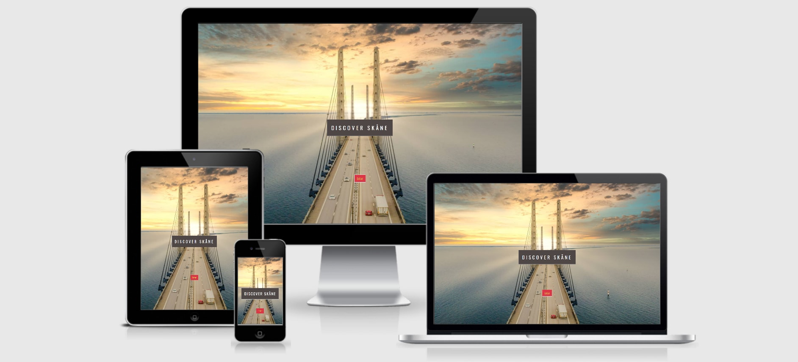

    
    
    
**A tourist website that showcases the region of Skåne in Southern Sweden**

Built using [GitHub Pages](https://pages.github.com/).
Click here to [Discover Skåne](https://hgoatly.github.io/MS2/)

# **Table of Contents:**

- [Site Owner's Goals](#site-owner's-goals)
- [User Experience (UX)](#user-experience--ux-)
  - [User stories](#user-stories)
    - [First Time Visitor Goals](#first-time-visitor-goals)
    - [Returning Visitor Goals](#returning-visitor-goals)
    - [Frequent Visitor Goals](#frequent-visitor-goals)

## Site Owner's Goals:

Discover Skåne is a tourist site showcasing the different types of holidays available in the county of Skåne, in Southern Sweden.
The site has two main objectives.

1. To provide information about the types of holiday activites available in Skåne for people who have already booked holidays there.

2. To showcase the different holiday activities available in Skåne to people who are looking to choose a holiday destination, 
in order for them to be able to make a hotel booking through the site.

It uses Google Maps API to pinpoint places of interest within the county, Booking.com Partner Centre 'Deal Finder' API as well as email.js
API in order to add interactivity to the site. 

The site can be viewed in both the English and Swedish languages.

## User Experience (UX):
### User Stories:
1. I have booked a holiday to Skåne, and I want to find out where there is a lake, so that I can go fishing.
2. I have booked a holiday to Skåne, and I want to find out where there is a lake, so that I can go swimming.
3. I have booked a holiday to Skåne, and I want to find out where there are some unspoilt forests, so that I can enjoy getting back to nature.
4. I have booked a holiday to Skåne, and I want to find out where there are some beaches, so that I can enjoy a seaside break.
5. I have booked a holiday to Skåne, and I want to find out where there are some cultural activities available, so that I can learn/see somehting new.
6. I want to find out whether there are any nice beaches in Skåne, so that I know whether to book a beach holiday there.
7. I want find out whether there are any unspoilt forests in Skåne, so that I know whether to book a holiday there where I can 'get away from it all'. 
8. I want to know what kind of cultural activities there are in the cities in Skåne, so that I know whether to book a city break there.

### First Time Visitor Goals:
- To find out what the county of Skåne has to offer as a holiday destination.

### Returning Visitor Goals: 
- To find out if any new content has been added for subsequent visits to Skåne.
- To contact the site owner to let them know about any places to visit in Skåne that they would like to recommend.