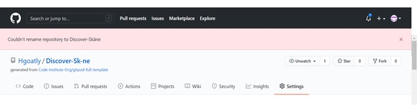
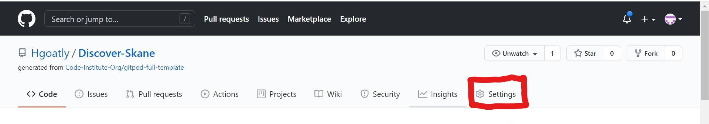
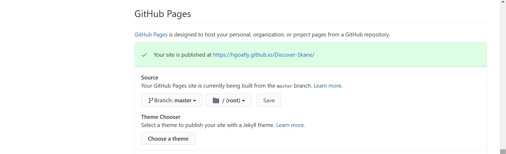
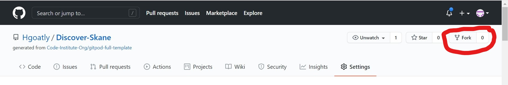
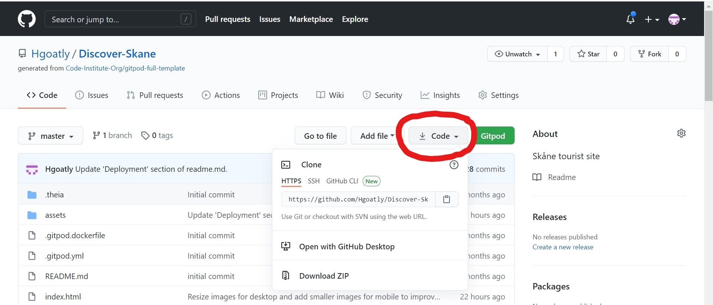

    
    
    
**A tourist website that showcases the region of Skåne in Southern Sweden**

Built using [GitHub Pages](https://pages.github.com/).
Click here to [Discover Skåne](https://hgoatly.github.io/MS2/).

# **Table of Contents:**

- [Site Owner Goals](#site-owner-goals)
- [User Experience (UX)](#user-experience-(ux))
  - [User stories](#user-stories)
    - [First Time Visitor Goals](#first-time-visitor-goals)
    - [Returning Visitor Goals](#returning-visitor-goals)
    - [Frequent Visitor Goals](#frequent-visitor-goals)
  - [Design](#Design)
    - [Colours Used](#colours-used)
    - [Typography](#typography) 
- [Technologies Used](#technologies-used)
- [Deployment](#deployment)

## Site Owner's Goals:

Discover Skåne is a tourist site showcasing the different types of holidays available in the county of Skåne, in Southern Sweden.
It is primarily an informative website. The site has two main objectives.

1. To provide information about the types of holiday activites available in Skåne for people who have already booked holidays there.

2. To showcase the different holiday activities available in Skåne to people who are looking to choose a holiday destination, 
in order for them to be able to make a hotel booking through the site.

It uses Google Maps API to pinpoint places of interest within the county, Booking.com Partner Centre 'Deal Finder' API as well as email.js
API in order to add interactivity to the site. 

The site can be viewed in both the English and Swedish languages.

The site is based on a one page layout with six distinct sections, plus an additional 'landing page'.
The first three sections are mainly informative, with interactivity provided by map elements. They are based around the different types of holiday that one can take in the Swedish county of Skåne.

The sections are as follows:
1. Lakes and Forests.
2. Beautiful Beaches.
3. City and Culture. 

Each of these three sections has three card elements with a picture on the front, and a map on the back. The text below talks about recommended places based 
on the theme of the card, for example, the text on the 'Lakes' card talks about recommended lakes to visit in Skåne. Below this, the user has the option to click on the text
that says 'Show on Map'. When clicked, this reveals the map specific to the that particular card. On the map, the recommended places to visit are 
marked on the map with a custom marker, specific to the theme of the card. When the marker is clicked, an infowindow appears, which displays the name of the location, some information about
the location, and the attribution - which is also a link to an external site from where the text for the infowindow was sourced, and where the site visitor can 
can learn more about the destination. 

The next section is the map section - which is both informative and interactive.
On the map, all of the markers from the 'Lakes and Forests', 'Beautiful Beaches' and 'City and Culture' sections are displayed, along with their infowindows.
As the map covers a larger area, and is less localised there are also additional custom markers for the cities of 'Malmö', 'Helsingborg' and 'Lund', with infowindows that display information in the 
same format as the other custom markers. 
Additionally, there is a 'search box' where the user can search the map for additional places of interest. 

The final two sections are mainly interactive. They are as follows:

1. Book.
2. Contact.

The 'Book' section uses the [Booking.com](https://www.booking.com/affiliate-program/v2/index.html?utm_source=&utm_campaign=&utm_content=&utm_term=&utm_medium=) affiliate partner program API,
so that after having chosen their ideal holidys in Skåne, visitors to the site can book their stay.

The 'contact' section encourages the user to contact the site owner via a contact form with their suggestions for places that could also be listed on the 'Discover Skåne' website as additional recommendations to site users. It uses the email.js API 

## User Experience (UX):
### User Stories:
1. I have booked a holiday to Skåne, and I want to find out where there is a lake, so that I can go fishing.
2. I have booked a holiday to Skåne, and I want to find out where there is a lake, so that I can go swimming.
3. I have booked a holiday to Skåne, and I want to find out where there are some unspoilt forests, so that I can enjoy getting back to nature.
4. I have booked a holiday to Skåne, and I want to find out where there are some beaches, so that I can enjoy a seaside break.
5. I have booked a holiday to Skåne, and I want to find out where there are some cultural activities available, so that I can learn/see somehting new.
6. I want to find out whether there are any nice beaches in Skåne, so that I know whether to book a beach holiday there.
7. I want find out whether there are any unspoilt forests in Skåne, so that I know whether to book a holiday there where I can 'get away from it all'. 
8. I want to know what kind of cultural activities there are in the cities in Skåne, so that I know whether to book a city break there.

### First Time Visitor Goals:
- To find out what the county of Skåne has to offer as a holiday destination.

### Returning Visitor Goals: 
- To find out if any new content has been added for subsequent visits to Skåne.
- To contact the site owner to let them know about any places to visit in Skåne that they would like to recommend.

### Frequent Visitor Goals: 
- To find out whether any new content has been added for subsequent visits to Skåne.
- To find out about different holiday options from those that the site visitor has already experienced.

### Design: 
- Landing Page: The idea of the 'Discover Skåne' landing page is to invite the site visitor to enter the main site. The hero image is 
a picture of the famous Öresunds Bridge, that connects the Swedish county of Skåne to Denmark. Superimposed on the image is the site logo 
and an 'Enter' button, that invites the user to click on it and enter the site - which is a metaphor for how they would 'Discover Skåne' by crossing the bridge physically.

#### Colours Used:
- Site Logo and Section Titles: The colour #4f4646, which is brown/grey, was chosen as the background colour, as it has a neutral, but somewhat 'Scandinavian' feel to it. It is also a 
good colour match with all of the images used throughout the site. The text colour is #fff (white) as it makes a good contrast with the background, and makes the text easy to read.

- Enter Button: The Skåne flag is a yellow cross on a red background. #dc3545 (red) was chosen for the background of the enter button, and #d8b54d (yellow) was chosen
for the text. This is to represent the Skåne flag. On a desktop, when the button is hovered over, the text colour changes to white. This is a metaphor for crossing the
bridge into Skåne, as the Danish flag is a white cross on a red background. It is representative of what the picture suggests: that you are leaving Denmark to enter Skåne.

- Navbar and Footer, Card Headers and 'Top of Page' Button: The background colour of each of these elements is #4f4646, and the text colour is #fff. It was deliberately decided that they should be the same colours as on the 
logo, to create a colour theme for the site.

- Cards: #fff was chosen as the background for the card elements, in order to make a good contrast with the text, for which the colour #4f4646 was chosen as it fits well with the general colour theme of the site.

- Site Background: The colour #f5f5f5 (off-white) was chosen as the background colour for the whole site. This is because it fits well with the general colour theme of the site, but also provides a subtle, yet distinct, contrast with 
the card elements, which have a background colour of #fff (white). 

### Typography: 
- 'Oswald' was chosen as the font for all of the Section Titles, with a fallback of 'cursive' - in case the 'Oswald' font fails to load. 
It was chosen as it it both bold and stylish - whilst able to be easily read.
- 'Roboto' was chosen as the font for the rest of the text, with a fallback of 'sans-serif' in case the 'Roboto font doesn't load. Roboto is 
clean and easy to read, which makes it an appropriate font for the text.

### Imagery: 
- Images of Skåne were chosen for the site that were considered to be both striking, and appropriate for their context. The landing page 
image was chosen as a visual metaphor for entering Skåne via the famous Öresund bridge. 
- Other appropriate images were chosen to represent different 
sections:
    - A picture of a pine forest was chosen for the 'Lakes and Forests' section.
    - A picture of a beach in Skåne was chosen for the 'Beautiful Beaches' section.
    - A picture of a castle in Skåne was chosen for the 'City and Culture' section. 
    - A picutre of a road in Skåne was chosen for the 'Map' section.
- The images of the hotel room, and of hands on a computer were not pictures that were taken 
in Skåne, but were more metaphorical in nature, and chosen to represent the 'Book' and 'Contact' 
sections respectively, as they are descriptive images that represent the content of their respective sections well.

### Layout: 
- The Bootstrap framework was used throughout the site to add responsiveness and facilitate mobile-first design.

### Wireframes: 
- The final Wireframes for this project can be viewed <a href="assets/wireframes/discover-skane.pdf" target="_blank">Here</a>
- Original Wireframes can be seen here. 
- The decision was made to change the orignal design from having a carousel of images to having a single image because of 
accessability concerns. 
- The decision not to have the 'Book' and 'Contact' sections in modals, and in their own sections on the main page, was 
taken on the advice of my mentor. The final design works better as now the modals do not break up the flow of the page.

## Features: 
'Discover Skåne' is built to be resonsive, on the principles of mobile-first design. The Bootstrap Grid System has helped 
facilitate this. With this in mind, there are some differences between the Mobile, Tablet and Desktop versions. All versions 
of the site have a fixed navbar and footer, with a 'scroll to top' button at the bottom of each section, which allows for the 
navbar to be easily accessed from wherever you are on the page.

### Mobile Design Features: 
- The navbar is collapsed, and accessed by clicking on the 'hamburger' icon in the top right hand corner.
- The images have been reduced in size, so that they are appropriate for a mobile screen, and so that they load quickly.
- All of the card elements have been collapsed into 'accordions', in order to provide better UX.
- The parallax feature has been disabled on ios devices, as the following CSS is not supported by ios: "background-attachment: fixed;". 
A media query was used to detect the ios operating system, and to set: "background-attchment: scroll;".

### Tablet Design Features:
- Devices with screen widths larger than 991 pixels 

## Deployment:

### Github Pages:
Discover Skåne was written in [Gitpod](https://www.gitpod.io/), and pushed to [Github](https://github.com/) for version control.
The repository was named 'Discover Skane' rather than 'Discover Skåne' as the letter 'å' was not a valid character, and 'Discover Sk-ne' 
was suggested instead.

It was deployed to [GitHub Pages](https://pages.github.com/) by following this process:

1. Log in to [Github](https://github.com/).
2. Locate the 'Discover Skane' repository.
3. Click on the 'Settings' option on the menu: 

4. Scroll down the 'Settings' page until the 'Github Pages' section is located.
5. Under 'Source', on the drop-down menu, select 'Branch: master' instead of 'Branch: none'.

6. Selection will be saved, and page automatically refreshed. 
7. To access the deployed site, click on the following link in the Github Pages section of the 'Settings' page:
[Discover Skåne](https://hgoatly.github.io/Discover-Skane/)

### Forking the Repository:

By forking the repository, the repository can be copied. Changes can then be made to it without affecting the original repository.
In order to do this, please take the following steps:

1. Log into Github, and select the [Discover Skane](https://hgoatly.github.io/Discover-Skane/) repository.
2. In the top right hand corner of the page, click on the 'fork' button.

3. This will create a copy of the original repository in your own account.

### Making a Local Clone:

The code can be run locally by taking the following steps:

1. Log into Github, and select the [Discover Skane](https://hgoatly.github.io/Discover-Skane/) repository.
2. Click on the 'code' button (circled in red below).

3. A dropdown will appear. 
4. On the top left hand side, HTTPS should already be selected. If it is not, please select it. 
5. Copy the link in the box underneath.

If you would like to use the code in Github, you can save it directly to Github Desktop by clicking on 'Open With Github Desktop'.
If you would prefer to download a zip file to be edited locally on your computer, please click on 'Download Zip. This will download 
a zip file directly to your computer to be used in your own code editor. 
