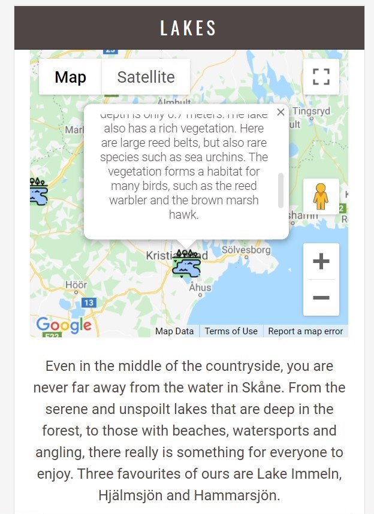

# Discover Skåne Testing:

The Discover Skåne site was discovered extensively, using the following processes:

# Table of Contents:

- [Chrome-Developer-Tools](#chrome-developer-tools)
- [W3c-Markup-Validation-Service](#W3C-markup-validation-service)
- [W3C-CSS-Validation-Service](#W3C-markup-validation-service)
- [JSHint](#jshint)
- [Testing-the-User-Stories](#testing-the-user-stories)
- [Testing-the-Swedish-Content](#testing-the-swedish-content)
- [Manual-Testing](#manual-testing)

## Chrome Developer Tools:

- Chrome developer tools was used regulraly to check the layout, and to check the console for errors.

## W3C Markup Validation Service:

- The [W3C-Markup-Validation-Service](https://validator.w3.org/) was used to check that HTML used for the site was compliant with modern standards.
The code passed the validator's tests with no errors or warnings:

## W3C CSS Validation Service: 

- The [W3C-CSS-Validation-Service](https://jigsaw.w3.org/) was used to check that CSS used on the site was compliant with modern standards. The code passed the 
validator's tests with no errors. 

    

There were, however, some warnings. These were to do with the code used to cross browser compatability for the display of background images.

    

## JSHint:

- JSHint was used to test the validity of the Javascript code in the project. 'Const' was flagged as a warning, but once it was told to
recognise ECMAScript 6 features by adding: '/*jshint esversion: 6 */' at the top, all Javascript code passed with no errors or warnings. 

## Testing the User Stories:

- The following user stories are listed in the README.md file. Images have been inserted below each of them to show how their requirements 
have been fulfilled.

### Lakes: 

- User stories one, two, three and nine are concerned with 'Lake' destinations:

1. I have booked a holiday to Skåne, and I want to find out where there is a lake, so that I can go fishing.
2. I have booked a holiday to Skåne, and I want to find out where there is a lake, so that I can go canoeing.
3. I have booked a holiday to Skåne, and I want to find out where there is a lake, so that I can enjoy the landscape and see some waterfoul.
9. I want to know where there are some nice lakes in Skåne, so that I know whether to book a holiday there. 

- Navigate to the 'Lakes and Forests' section. 
  
  - **Test Case 1**
    - Ensure that the 'Lakes' image shows a picture of a lake. 
  - **Expected Result**: 'Lakes' image should be visible.
  - **Actual Result**: 'Lakes' image is visible.
  - **Pass/Fail**: Pass.

    

    
    
 

  - **Test Case 2**
    - Ensure that the text below the image details some recommended lakes in Skåne. 
  - **Expected Result**: Text below the 'Lakes' image should be visible.
  - **Actual Result**: Text below the 'Lakes' image is visible.
  - **Pass/Fail**: Pass.

  

    
    
 

  - **Test Case 3**
    - Ensure that when 'Show on Map' is clicked, the map is visible, and the image is hidden.
  - **Expected Result**: When 'Show on Map' is clicked, the map should be visible, and the image should be hidden.
  - **Actual Result**: When 'Show on Map' is clicked, the map is visible, and the image is hidden.
  - **Pass/Fail**: Pass.

    

    
    

  
  - **Test Case 4** 
    - Ensure that when 'Hide Map is clicked, the map is hidden and the image is visible.
  - **Expected Result**: When 'Hide Map' is clicked, the map will be hidden, and the image will be visible.
  - **Actual Result**:  When 'Hide Map' is clicked, the map will is hidden, and the image is visible.
  - **Pass/Fail**: Pass.

    

    
    
 

  - **Test Case 5**
    - Ensure that there are custom markers on each map. 
  - **Expected Result**: When map is visible, custom markers will be displayed on it. Markers that are close together will be displayed as marker clusters.
  - **Actual Result**: When map is visible, custom markers is displayed on it. Markers that are close together are displayed as marker clusters.
  - **Pass/Fail**: Pass.
    
    

    

  - **Test Case 6**
    - Ensure that when clicked, each marker will display an infowindow. 
  - **Expected Result**: Each marker will display an infowindow when clicked.
  - **Actual Result**: Each marker displays an infowindow when clicked.
  - **Pass/Fail**: Pass.
    
    

    
    
 
    
    

    
    
 

    

    
    

  - **Test Case 7**
    - Ensure that the Hjälmsjön and Lake Immeln infowindows display information about canoeing and fishing.
  - **Expected Result**: The Hjälmsjön and Lake Immeln infowindows will display information about canoeing and fishing.
  - **Actual Result**:  The Hjälmsjön and Lake Immeln infowindows display information about canoeing and fishing.
  - **Pass/Fail**: Pass.

    

    
    
 
    
    

    
    
 

  - **Test Case 8**
    - Ensure that the Hammarsjön infowindow details information about the landscape and waterfoul in the area. 
  - **Expected Result**: The Hammarsjön infowindow will display information about the landscape and waterfoul in the area.
  - **Actual Result**: The Hammarsjön infowindow displays information about the landscape and waterfoul in the area.
  - **Pass/Fail**: Pass.

     

    
    
 

     

    
    
 

  - **Test Case 9**
    - Ensure that the 'Attribution' link on each infowindow works, and takes the user to an external site, which opens in a
  new tab.
  - **Expected Result**: All 'Attribution' links should work, with external sites opening in new tabs. 
  - **Actual Result**: All 'Attribution' links work, with external sites opening in new tabs. 
  - **Pass/Fail**: Pass.

    

    
    
 

    

    
    
 

    

    
    
 

    

    
    
 

    

    
    
 

    

    
    
 

### Forests and National Parks: 

- The fourth and eighth user stories are concerned with 'Forests' and 'National Parks' destinations:

4. I have booked a holiday to Skåne, and I want to find out where there are some unspoilt forests and National Parks, so that I can enjoy getting back to nature.
8. I want find out whether there are any unspoilt forests in Skåne, so that I know whether to book a holiday there where I can 'get away from it all'. 

- Navigate to the 'Lakes and Forests' section. 
  - **Test Case 1**:
    - Ensure that the 'Forests' and 'National Parks' images show pictures of a National Park, and a Forest. 
  - **Expected Result**: 'Forests' and 'National Parks' images will be visible.
  - **Actual Result**: 'Forests' and 'National Parks' images are visible.
  - **Pass/Fail**: Pass.

    

    
    
 

    

    
    
 

  - **Test Case 2**: 
    - Ensure the that text below the images details some recommended forests and National Parks in Skåne. 
  - **Expected Results**: Text below 'Forests' and 'National Parks' images will be visible.
  - **Actual Results**: Text below 'Forests' and 'National Parks' images is visible.
  - **Pass/Fail**: Pass.

    

    
    
 

    

    
    
 

  - **Test case 3**:
    - Ensure that when 'Show on Map is clicked, the map is visible, and the image is hidden. 
  - **Expected Result**: When 'Show on Map' is clicked, the map will be visible, and the image will be hidden.
  - **Actual Result**: When 'Show on Map' is clicked, the map is visible, and the image is hidden.
  - **Pass/Fail**: Pass.

    

    
    
 

  

    
    
 

  - **Test Case 4**:
    - Ensure that when 'Hide Map is clicked, the map is hidden and the image is visible.
  - **Expected Result**: When 'Hide Map' is clicked, the map will be hidden, and the image will be visible.
  - **Actual Result**: When 'Hide Map' is clicked, the map will be hidden, and the image will be visible.
  - **Pass/Fail**: Pass.

    

    
    
 

    

    
    
 

  - **Test Case 5**:
    - Ensure that there are custom markers on each map. 
  - **Expected Result**: When maps are visible, custom markers will be displayed on them. Markers that are close together will be displayed as marker clusters.
  - **Actual Result**: When maps are visible, custom markers are displayed on them. Markers that are close together are displayed as marker clusters.
  - **Pass/Fail**: Pass.

    

    
    
 

  

    
    
 

  - **Test Case 6**:
    - Ensure that when clicked, each marker will display an infowindow. 
  - **Expected Result**: Each marker will display an infowindow when clicked.
  - **Actual Result**: Each marker displays an infowindow when clicked.
  - **Pass/Fail**: Pass.
    
    

    
    
 
 
    

    
    
 

    

    
    
 

    

    
    
 

    

    
    
 

  - **Test Case 7**:
    - Ensure that each infowindow details information about recommended forests or National Parks in Skåne. 
  - **Expected Result**: Each infowindow will display information about a forest or a National Park in Skåne.
  - **Actual Result**: Each infowindow displays information about a forest or a National Park in Skåne.
  - **Pass/Fail**: Pass.
  
    

    
    
 

    

    
    
 

    

    
    
 

    

    
    
 

    

    
    
 

  - **Test Case 8**:
    - Ensure that the 'Attribution' link on each infowindow works, and takes the user to an external site, which opens in a
  new tab.
  - **Expected Result**: 'Attribution' links on each infowindow will take the user to an external site, which opens in a new tab.
  - **Actual Result**:  'Attribution' links on each infowindow take the user to external sites, which open in a new tab.
  - **Pass/Fail**: Pass.

    

    
    
 

    

    
    
 

    

    
    
 

    

    
    
 

    

    
    
 

    

    
    
 

    

    
    
 

    

    
    
 

    

    
    
 

    

    
    
 

### Beautiful Beaches:

- User stories five and seven are concerned with finding beaches suitable for a seaside holiday. 

5. I have booked a holiday to Skåne, and I want to find out where there are some beaches, so that I can enjoy a seaside break.
7. I want to find out whether there are any nice beaches in Skåne, so that I know whether to book a beach holiday there.

- Navigate to the 'Beautiful Beaches' section of the website.
  
  - **Test Case 1**:
    - Ensure that the 'East Coast', 'West Coast' and 'South Coast' images show pictures of beaches. 
  - **Expected Result**: 'East Coast', 'West Coast' and 'South Coast' images will be visible.
  - **Actual Result**: 'East Coast', 'West Coast' and 'South Coast' images are visible.
  - **Pass/Fail**: Pass.
    
    

    
    
 

  - **Test Case 2**:
    - Ensure the that text below each image details some recommended beaches in Skåne.
  - **Expected Results**: Text below 'East Coast', 'West Coast and 'South Coast' images will be visible.
  - **Actual Results**: Text below 'East Coast', 'West Coast and 'South Coast' images is visible.
  - **Pass/Fail**: Pass.

    

    
    
 

  - **Test Case 3**:
    - Ensure that when 'Show on Map is clicked, the map is visible, and the image is hidden. 
  - **Expected Result** When 'Show on Map' is clicked, the map will be visible, and the image will be hidden.
  - **Actual Result**: When 'Show on Map' is clicked, the map is visible, and the image is hidden.
  - **Pass/Fail**: Pass.
    
    

    
    
 

  - **Test Case 4**:
    - Ensure that when 'Hide Map is clicked, the map is hidden and the image is visible.
  - **Expected Result**: When 'Hide Map' is clicked, the map will be hidden, and the image will be visible.
  - **Actual Result**: When 'Hide Map' is clicked, the map is hidden, and the image is visible.
  - **Pass/Fail**: Pass.
  
    

    
    
 

  - **Test Case 5**: 
    - Ensure that there are custom markers on each map.
  - **Expected Result**: When maps are visible, custom markers will be displayed on them. Markers that are close together will be displayed as marker clusters.
  - **Actual Result**: When maps are visible, custom markers are displayed on them. Markers that are close together are displayed as marker clusters.
  - **Pass/Fail**: Pass.

    

    
    
 

  - **Test Case 6**:
    - Ensure that when clicked, each marker will display an infowindow. 
  - **Expected Result**: Each marker will display an infowindow when clicked.
  - **Actual Result**: Each marker displays an infowindow when clicked.
  - **Pass/Fail**: Pass.

    

    
    
 

    

    
    
 

    

    
    
 

    

    
    
 

    

    
    
 

    

    
    
 

     

    
    
 

    

    
    
 

    

    
    
 

  - **Test Case 7**:
    - Ensure that each infowindow details information about recommended beaches in Skåne. 
  - **Expected Result**: Each infowindow will display information about a beach in Skåne.
  - **Actual Result**: Each infowindow displays information about a beach in Skåne.
  - **Pass/Fail**: Pass.

  

    
    
 

    

    
    
 

    

    
    
 

    

    
    
 

    

    
    
 

    

    
    
 

     

    
    
 

    

    
    
 

    

    
    
 

  - **Test Case 8**:
    - Ensure that the 'Attribution' link on each infowindow works, and takes the user to an external site, which opens in a
  new tab.
  - **Expected Result**: 'Attribution' links on each infowindow will take the user to an external site, which opens in a new tab.
  - **Actual Result**: 'Attribution' links on each infowindow take the user to an external site, which opens in a new tab.
  - **Pass/Fail**: Pass.

    

    
    
 

    

    
    
 

    

    
    
 

    

    
    
 

    

    
    
 

    

    
    
 

    

    
    
 

    

    
    
 

    

    
    
 

    

    
    
 

    

    
    
 

    

    
    
 

    

    
    
 

    

    
    
 

    

    
    
 

    

    
    
 

    

    
    
 

    

    
    
 

### City and Culture:

- User stories six and ten are concerned with cultural activities in the region.

6. I have booked a holiday to Skåne, and I want to find out where there are some cultural activities available, so that I can learn/see somehting new.
10. I want to know what kind of cultural activities there are in the largest cities in Skåne, so that I know whether to book a city break there.

- Navigate to the 'City and Culture' section of the website.
- **Test Case 1**:
  - Ensure that the 'Malmö', 'Helsingborg' and 'Lund' images show pictures of each city. 
- **Expected Result**: 'Malmö', 'Helsingborg' and 'Lund' images are visible.
- **Actual Result**: 'Malmö', 'Helsingborg' and 'Lund' images are visible.
- **Pass/Fail**: Pass.

    

    
    
 

- **Test Case 2**:
  - Ensure the that text below each image details recommended cultural activities in Malmö, Helsingborg and Lund respectively. 
- **Expected Results**: Text below 'Malmö', 'Helsingborg' and 'Lund' images will be visible.
- **Actual Results**: Text below 'Malmö', 'Helsingborg' and 'Lund' images is visible.
- **Pass/Fail**: Pass.

    

    
    
 

- **Test Case 3**:
  - Ensure that when 'Show on Map is clicked, the map is visible, and the image is hidden. 
- **Expected Result** When 'Show on Map' is clicked, the map will be visible, and the image will be hidden.
- **Actual Result**: When 'Show on Map' is clicked, the map is visible, and the image is hidden.

    
    
 

- **Test Case 4**:
  - Ensure that when 'Hide Map is clicked, the map is hidden and the image is visible.
- **Expected Result**: When 'Hide Map' is clicked, the map will be hidden, and the image will be visible.
- **Actual Result**: When 'Hide Map' is clicked, the map is hidden, and the image is visible.
- **Pass/Fail**: Pass.

    
    
 

- **Test Case 5**:
  - Ensure that there are custom markers on each map. 
- **Expected Result**: When maps are visible, custom markers will be displayed on them. Markers that are close together will be displayed as marker clusters.
- **Actual Result**: When maps are visible, custom markers are displayed on them. Markers that are close together are displayed as marker clusters.
- **Pass/Fail**: Pass.

    

    
    
 

- **Test Case 6**:
  - Ensure that when clicked, each marker will display an infowindow. 
- **Expected Result**: Each marker will display an infowindow when clicked.
- **Actual Result**: Each marker displays an infowindow when clicked.
- **Pass/Fail**: Pass.

    

    
    
 

    

    
    
 

    

    
    
 

    

    
    
 

    

    
    
 

    

    
    
 

    

    
    
 

    

    
    
 

    

    
    
 

    

    
    
 

- **Test Case 7**:
  - Ensure that each infowindow details information about recommended cultural activities in Malmö, Helsingborg and Lund. 
- **Expected Result**: Each infowindow will display information about recommended cultural activities in Malmö, Helsingborg and Lund.
- **Actual Result**:  Each infowindow displays information about recommended cultural activities in Malmö, Helsingborg and Lund.
- **Pass/Fail**: Pass.

    

    
    
 

    

    
    
 

    

    
    
 

    

    
    
 

    

    
    
 

    

    
    
 

    

    
    
 

    

    
    
 

    

    
    
 

    

    
    
 

- **Test Case 8**:
  - Ensure that the 'Attribution' link on each infowindow works, and takes the user to an external site, which opens in a
  new tab.
- **Expected Result**: The 'Attribution' link will navigate to an external site, which opens in a new tab.
- **Actual Result**: The 'Attribution' link navigates to an external site, which opens in a new tab.
- **Pass/Fail**: Pass.

    

    
    
 

    

    
    
 

    

    
    
 

    

    
    
 

    

    
    
 

    

    
    
 

    

    
    
 

    

    
    
 

    

    
    
 

    

    
    
 

    

    
    
 

    

    
    
 

    

    
    
 

    

    
    
 

    

    
    
 

    

    
    
 
    
### Book: 

11. I want to find some hotel deals, so that I can book my holiday in Skåne.

- Navigate to the 'Book' section of the website.
  - **Test Case 1**:
    - Ensure that the 'Booking.com' Dealfinder renders, and displays a selection of hotel deals in Skåne.
  - **Expected Result**: The 'Booking.com' Dealfinder API will render, and a selection of available hotels in Skåne
  will be visible.
  - **Actual Result**: The 'Booking.com' Dealfinder API renders, and a selection of available hotels in Skåne
  is visible.

    

    
    
 
  
  - **Test Case 2**:
    - Ensure that when clicked, the 'See All Deals' button takes the user to an external site, which opens in a new tab.
  - **Expected Result**: The 'See All Deals' button will take users to the 'Booking.com' site, which will open in a new tab.
  - **Actual Result**: The 'See All Deals' button takes users to the 'Booking.com' site, which opens in a new tab.
  - **Pass/Fail**: Pass.

### Map:

12. I want to view all the recommended places to visit in Skåne on one map, so that I know where they all are in relation to one another.

- Navigate to the 'Map' section of the website.
- **Test Case 1**:
  - Ensure that Google Maps API map renders.
- **Expected Result**: Google map should be visible.
- **Actual Result**: Google map is visible.
- **Pass/Fail**: Pass.
    
    

    
    
 

- **Test Case 2**: 
  - Ensure that all custom markers are visible on the map.
- **Expected Result**: All custom markers will be visible. When markers are close together, they will appear as a marker cluster.
- **Actual Result**: All custom markers are visible. When markers are close together, they appear as a marker cluster.
- **Pass/Fail**: Pass.

    

    
    
 

- **Test Case 3**:
  - Ensure that all custom markers open infowindows when clicked.
- **Expected Result**: All custom markers will open an infowindow when clicked.
- **Actual Result**: All custom markers open an infowindow when clicked.
- **Pass/Fail**: Pass.

- **Test Case 4**: 
  - Ensure that all infowindows display relevant information about their location.
- **Expected Result**: All infowindows will display relevant information about their location.
- **Actual Result**: All infowindows display relevant information about their location.
- **Pass/Fail**: Pass.

- **Test Case 5**: 
  - Ensure that 'Attribution' links navigate to external sites when clicked, and that they open in new tabs.
- **Expected Result**: All 'Attribution' links will navigate to external sites, which open in new tabs.
- **Actual Result**: All 'Attribution' links navigate to external sites, which open in new tabs.

### Contact: 

13. I want to get in touch with the site owner so that I can recommend more places to visit in Skåne.

- **Test Case 1**:
  - Ensure that the contact form is visible and behaves as expected.
  - Navigate to the 'Book' section of the page.
    - Ensure that the contact form is visible and displays the following fields:
      - 'Name' 
      - 'Email'
      - 'Your recommendations'
    - Enter the following data into form fields:
      - Your name.
      - your email in the following format: name@host.com.
      - Your recommendations (text input)
    - Click 'Submit'
      - Ensure alert box appears with the following message: "Thank you. Your email has been sent. We'll get back to you as soon as we can!"
  - **Expected Result**: Form submits without errors, and alert box confirms submission.
  - **Actual Result**: Form submits without errors, and alert box confirms sbmission.
  - **Pass/Fail**: Pass.
  
## Manual Testing:

- Manual testing was carried out across a variety of browsers. The results are detailed here: 