# Discover Skåne Testing:

The Discover Skåne site was tested extensively, using the following processes:

# Table of Contents:

- [Chrome-Developer-Tools](#chrome-developer-tools)
- [W3c-Markup-Validation-Service](#W3C-markup-validation-service)
- [W3C-CSS-Validation-Service](#W3C-markup-validation-service)
- [JSHint](#jshint)
- [Testing-the-User-Stories](#testing-the-user-stories)
- [Testing-the-Swedish-Content](#testing-the-swedish-content)
- [Manual-Testing](#manual-testing)

## Chrome Developer Tools:

- Chrome developer tools was used regulraly to check the layout, and to check the console for errors.

## W3C Markup Validation Service:

- The [W3C-Markup-Validation-Service](https://validator.w3.org/) was used to check that HTML used for the site was compliant with modern standards.
The code passed the validator's tests with no errors or warnings:

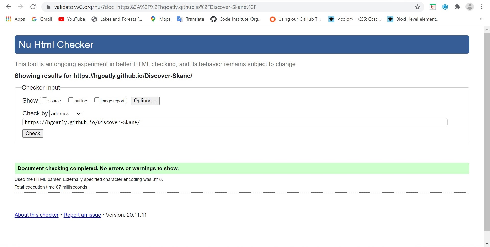 

## W3C CSS Validation Service: 

- The [W3C-CSS-Validation-Service](https://jigsaw.w3.org/) was used to check that CSS used on the site was compliant with modern standards. The code passed the 
validator's tests with no errors. 

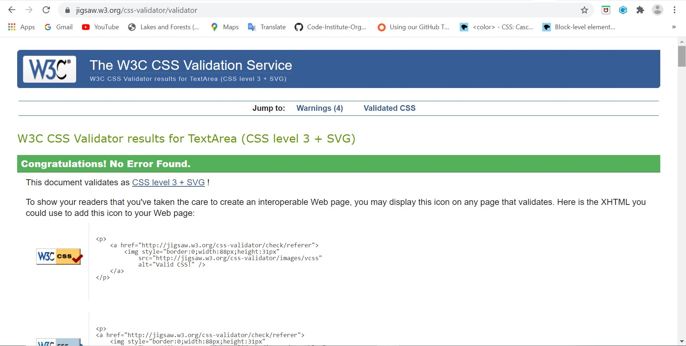

There were, however, some warnings. These were to do with the code used to cross browser compatability for the display of background images.

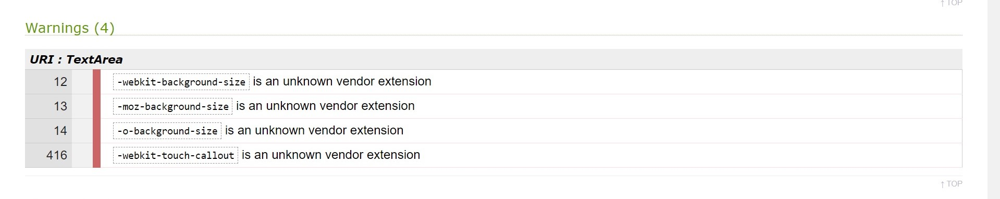

## JSHint:

- JSHint was used to test the validity of the Javascript code in the project. 'Const' was flagged as a warning, but once it was told to
recognise ECMAScript 6 features by adding: '/*jshint esversion: 6 */' at the top, all Javascript code passed with no errors or warnings. 

## Testing the User Stories:

- The following user stories are listed in the README.md file. Images have been inserted below each of them to show how their requirements 
have been fulfilled.

### Lakes: 

- User stories one, two, three and nine are concerned with 'Lake' destinations:

1. I have booked a holiday to Skåne, and I want to find out where there is a lake, so that I can go fishing.
2. I have booked a holiday to Skåne, and I want to find out where there is a lake, so that I can go canoeing.
3. I have booked a holiday to Skåne, and I want to find out where there is a lake, so that I can enjoy the landscape and see some waterfoul.
9. I want to know where there are some nice lakes in Skåne, so that I know whether to book a holiday there. 

- Navigate to the 'Lakes and Forests' section by selecting 'Lakes and Forests' on the navbar, or by scrolling down the page. 
  
  - **Test Case 1**
    - Ensure that the 'Lakes' image shows a picture of a lake. 
  - **Expected Result**: 'Lakes' image should be visible.
  - **Actual Result**: 'Lakes' image is visible.
  - **Pass/Fail**: Pass.
    
    - Screenshot of the 'Lakes' card, clearly showing the image:

    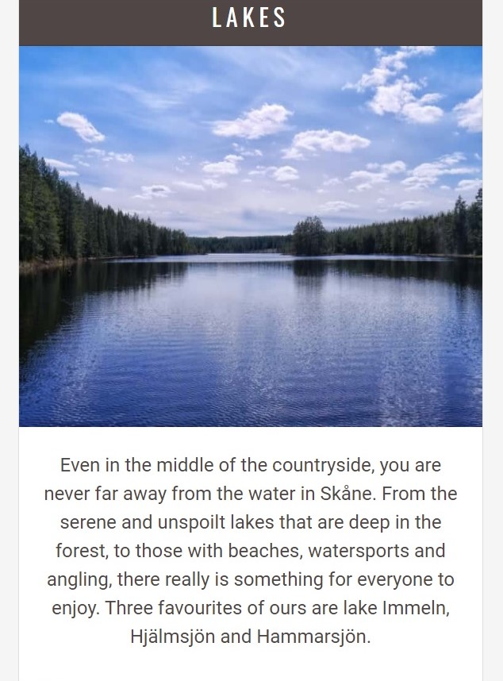

  - **Test Case 2**
    - Ensure that the text below the image details some recommended lakes in Skåne. 
  - **Expected Result**: Text below the 'Lakes' image should be visible.
  - **Actual Result**: Text below the 'Lakes' image is visible.
  - **Pass/Fail**: Pass.

    - Screenshot of the 'Lakes' card, with the text clearly visible below the image:
  
  
 
  - **Test Case 3**
    - Ensure that when 'Show on Map' is clicked, the map is visible, and the image is hidden.
  - **Expected Result**: When 'Show on Map' is clicked, the map should be visible, and the image should be hidden.
  - **Actual Result**: When 'Show on Map' is clicked, the map is visible, and the image is hidden.
  - **Pass/Fail**: Pass.

    - Screenshot of the 'Lakes' card, with the map clearly visible, after 'Show on Map' has been clicked.

    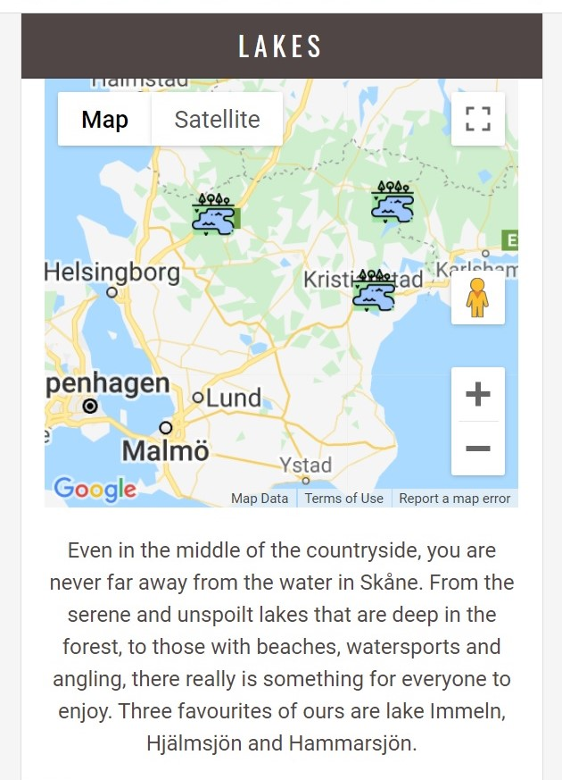
  
  - **Test Case 4** 
    - Ensure that when 'Hide Map is clicked, the map is hidden and the image is visible.
  - **Expected Result**: When 'Hide Map' is clicked, the map will be hidden, and the image will be visible.
  - **Actual Result**:  When 'Hide Map' is clicked, the map will is hidden, and the image is visible.
  - **Pass/Fail**: Pass.
    
    - Screenshot of the 'Lakes' card, with the image clearly visible after 'Hide Map' has been clicked.
     
    

  - **Test Case 5**
    - Ensure that there are custom markers on each map. 
  - **Expected Result**: When map is visible, custom markers will be displayed on it. Markers that are close together will be displayed as marker clusters.
  - **Actual Result**: When map is visible, custom markers is displayed on it. Markers that are close together are displayed as marker clusters.
  - **Pass/Fail**: Pass.
    
    - Screenshot of the 'Lakes' map, with custom markers clearly visible.

    

  - **Test Case 6**
    - Ensure that when clicked, each marker will display an infowindow. 
  - **Expected Result**: Each marker will display an infowindow when clicked.
  - **Actual Result**: Each marker displays an infowindow when clicked.
  - **Pass/Fail**: Pass.
    
    - Screenshot of the Hjälmsjön infowindow, clearly visible on the 'Lakes' map.

    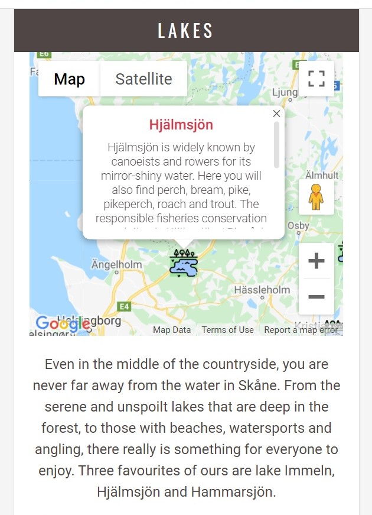
    
    - Screenshot of the Lake Immeln infowindow, clearly visible on the 'Lakes' map.

    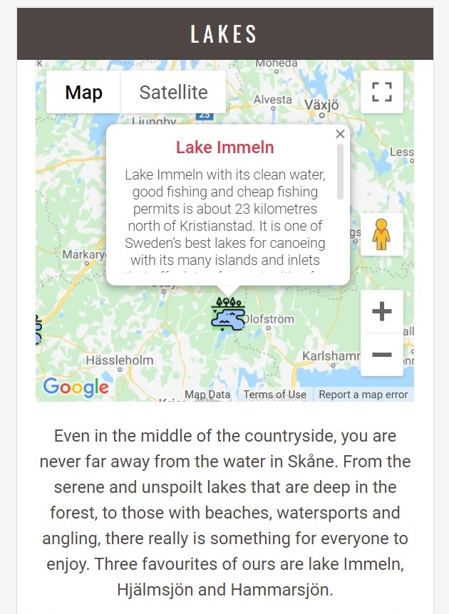

    - Screenshot of the Hammarsjön infowindow, clearly visible on the 'Lakes' map.

    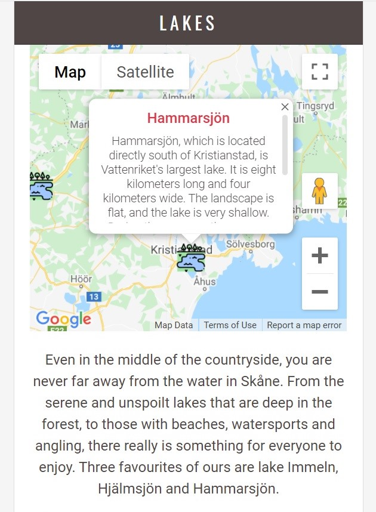

  - **Test Case 7**
    - Ensure that the Hjälmsjön and Lake Immeln infowindows display information about canoeing and fishing.
  - **Expected Result**: The Hjälmsjön and Lake Immeln infowindows will display information about canoeing and fishing.
  - **Actual Result**:  The Hjälmsjön and Lake Immeln infowindows display information about canoeing and fishing.
  - **Pass/Fail**: Pass.
    
    - Screenshot of the Hjälmsjön infowindow with information about canoeing and fishing clearly visible. 

    
    
    - Screenshot of the Lake Immeln infowindow with information about canoeing and fishing clearly visible. 

    
    
  - **Test Case 8**
    - Ensure that the Hammarsjön infowindow details information about the landscape and waterfoul in the area. 
  - **Expected Result**: The Hammarsjön infowindow will display information about the landscape and waterfoul in the area.
  - **Actual Result**: The Hammarsjön infowindow displays information about the landscape and waterfoul in the area.
  - **Pass/Fail**: Pass.

    - Screenshots of the Hammarsjön infowindow with information about the landscape and waterfoul clearly visible. 

    

  - **Test Case 9**
    - Ensure that the 'Attribution' link on each infowindow works, and takes the user to an external site, which opens in a
  new tab.
  - **Expected Result**: All 'Attribution' links should work, with external sites opening in new tabs. 
  - **Actual Result**: All 'Attribution' links work, with external sites opening in new tabs. 
  - **Pass/Fail**: Pass.

    - Screenshot of the Hjälmsjön infowindow with the 'Attribution' link clearly displayed.
    
    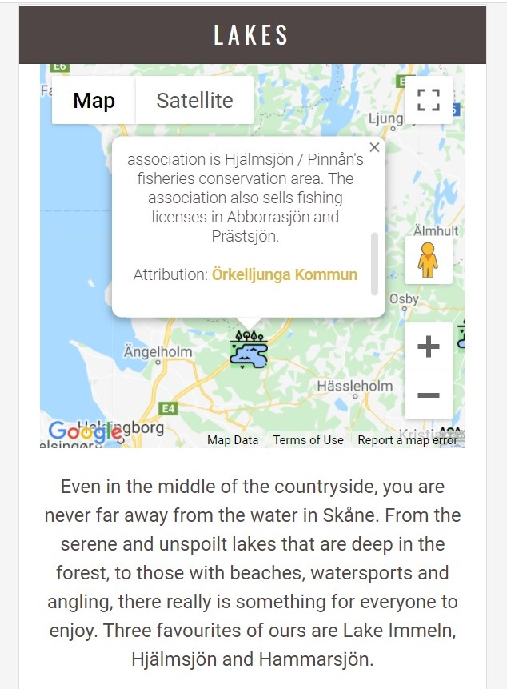

    - Screenshot of the Hjälmsjön external site open in a new tab.

    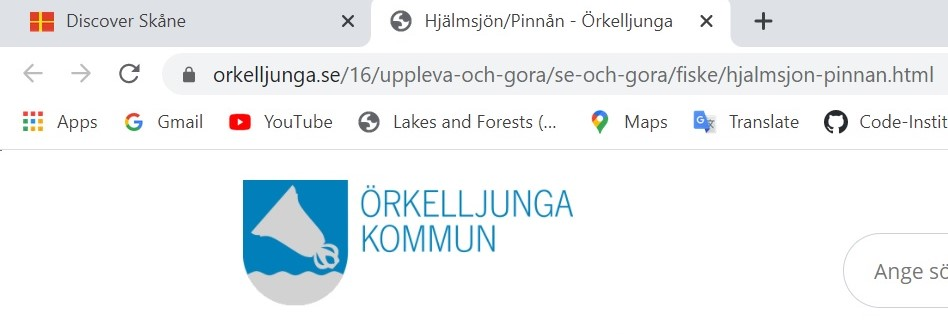

    - Screenshot of the Lake Immeln infowindow with the 'Attribution' link clearly displayed.

    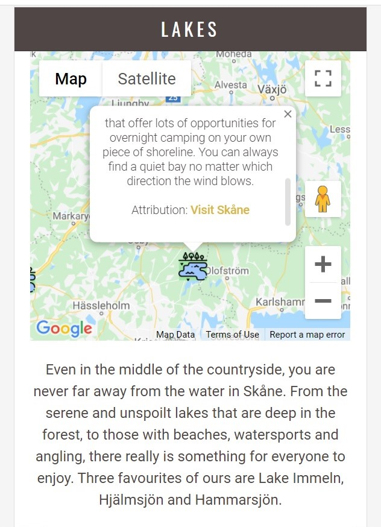

    - Screenshot of the Lake Immeln external site displayed in a new tab.

    

    - Screenshot of the Hammarsjön infowindow with the 'Attribution' link clearly displayed.

    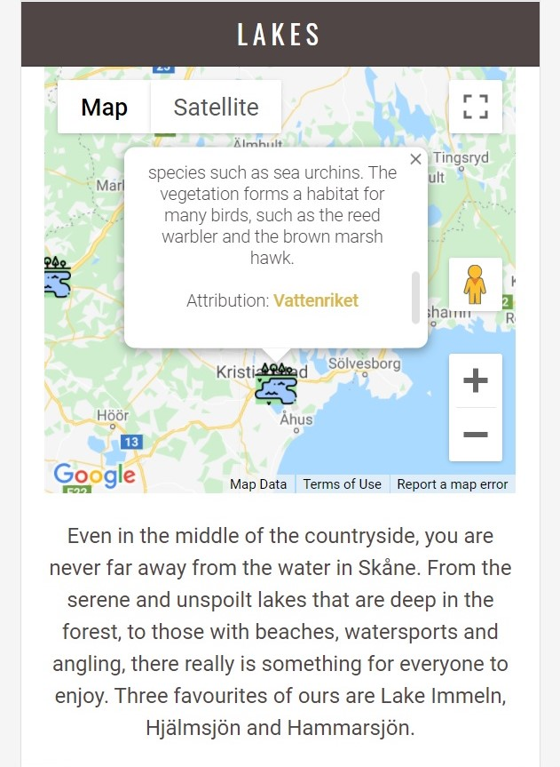

    - Screenshot of the Hammarsjön external site displayed in a new tab.

    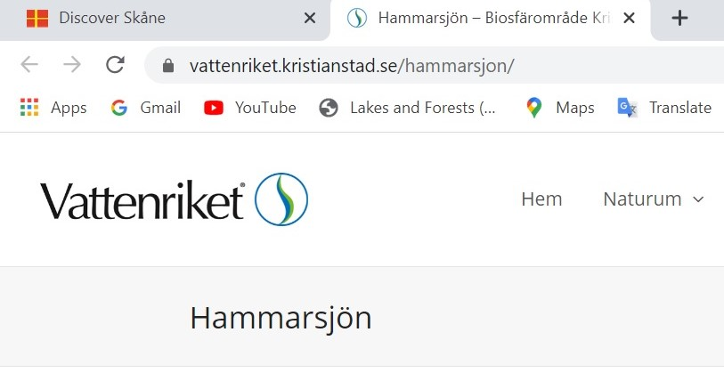

### Forests and National Parks: 

- The fourth and eighth user stories are concerned with 'Forests' and 'National Parks' destinations:

4. I have booked a holiday to Skåne, and I want to find out where there are some unspoilt forests and National Parks, so that I can enjoy getting back to nature.
8. I want find out whether there are any unspoilt forests in Skåne, so that I know whether to book a holiday there where I can 'get away from it all'. 

- Navigate to the 'Lakes and Forests' section by selecting 'Lakes and Forests' on the navbar, or by scrolling down the page. 
  
  - **Test Case 1**:
    - Ensure that the 'Forests' and 'National Parks' images show pictures of a National Park, and a Forest. 
  - **Expected Result**: 'Forests' and 'National Parks' images will be visible.
  - **Actual Result**: 'Forests' and 'National Parks' images are visible.
  - **Pass/Fail**: Pass.

    - Screenshot of the 'Forests' card, with the image clearly visible.

    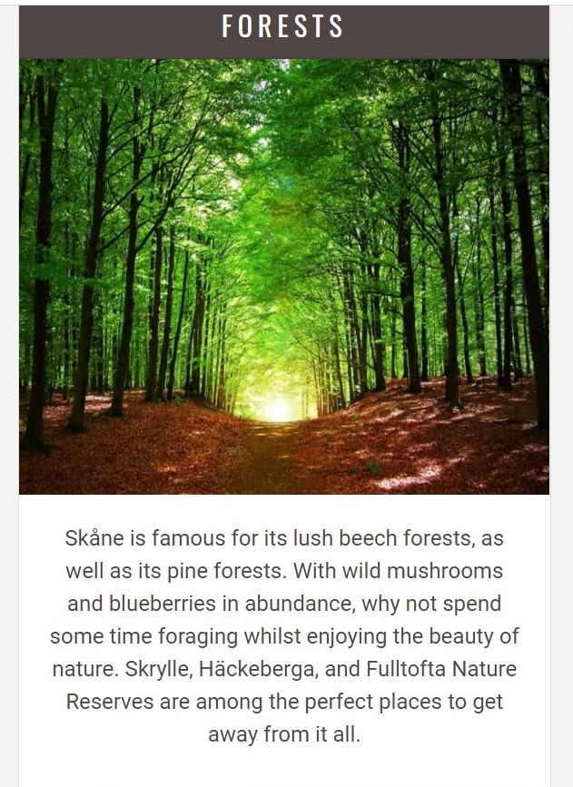

    - Screenshot of the 'National Parks' card, with the image clearly visible.

    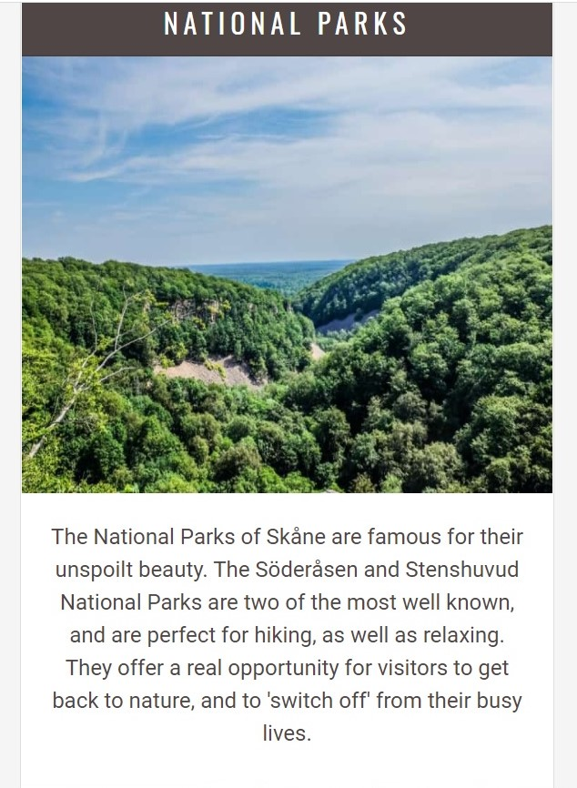

  - **Test Case 2**: 
    - Ensure the that text below the images details some recommended forests and National Parks in Skåne. 
  - **Expected Results**: Text below 'Forests' and 'National Parks' images will be visible.
  - **Actual Results**: Text below 'Forests' and 'National Parks' images is visible.
  - **Pass/Fail**: Pass.

    - Screenshot of the 'Forests' card with the text below the image clearly visible.

    

    - Screenshot of the 'National parks' card, with the text below the image clearly visible.

    

  - **Test case 3**:
    - Ensure that when 'Show on Map is clicked, the map is visible, and the image is hidden. 
  - **Expected Result**: When 'Show on Map' is clicked, the map will be visible, and the image will be hidden.
  - **Actual Result**: When 'Show on Map' is clicked, the map is visible, and the image is hidden.
  - **Pass/Fail**: Pass.

     - Screenshot of the 'Forests' card, with the map clearly visible, after 'Show on Map' has been clicked.

    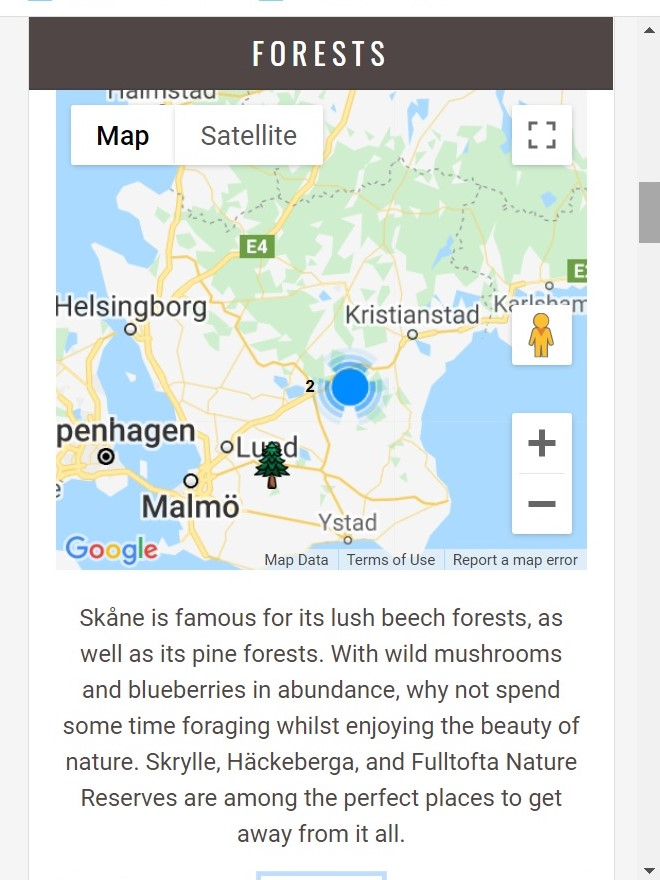

     - Screenshot of the 'National Parks' card, with the map clearly visible, after 'Show on Map' has been clicked.

    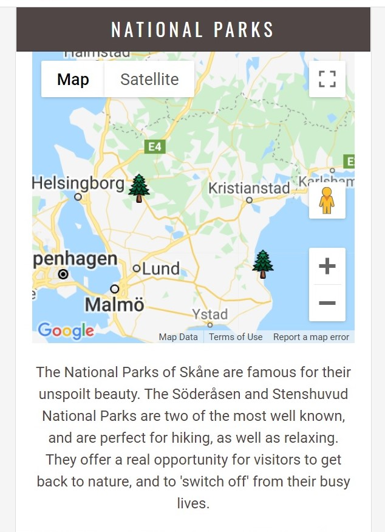

  - **Test Case 4**:
    - Ensure that when 'Hide Map is clicked, the map is hidden and the image is visible.
  - **Expected Result**: When 'Hide Map' is clicked, the map will be hidden, and the image will be visible.
  - **Actual Result**: When 'Hide Map' is clicked, the map will be hidden, and the image will be visible.
  - **Pass/Fail**: Pass.

     - Screenshot of the 'Forests' card, with the image clearly visible, after 'Hide Map' has been clicked.

    

    - Screenshot of the 'National Parks' card, with the image clearly visible, after 'Hide Map' has been clicked.

    

  - **Test Case 5**:
    - Ensure that there are custom markers on each map. 
  - **Expected Result**: When maps are visible, custom markers will be displayed on them. Markers that are close together will be displayed as marker clusters.
  - **Actual Result**: When maps are visible, custom markers are displayed on them. Markers that are close together are displayed as marker clusters.
  - **Pass/Fail**: Pass.

    - Screenshot of the 'Forests' map with custom marker and marker cluster clearly visible.
    
    

    - Screenshot of the 'National Parks' screenshot with custom markers clearly visible.

    

  - **Test Case 6**:
    - Ensure that when clicked, each marker will display an infowindow. 
  - **Expected Result**: Each marker will display an infowindow when clicked.
  - **Actual Result**: Each marker displays an infowindow when clicked.
  - **Pass/Fail**: Pass.
    
    - Screenshot of the 'National Parks' map with the Sö‎deråsen infowindow clearly displayed.

    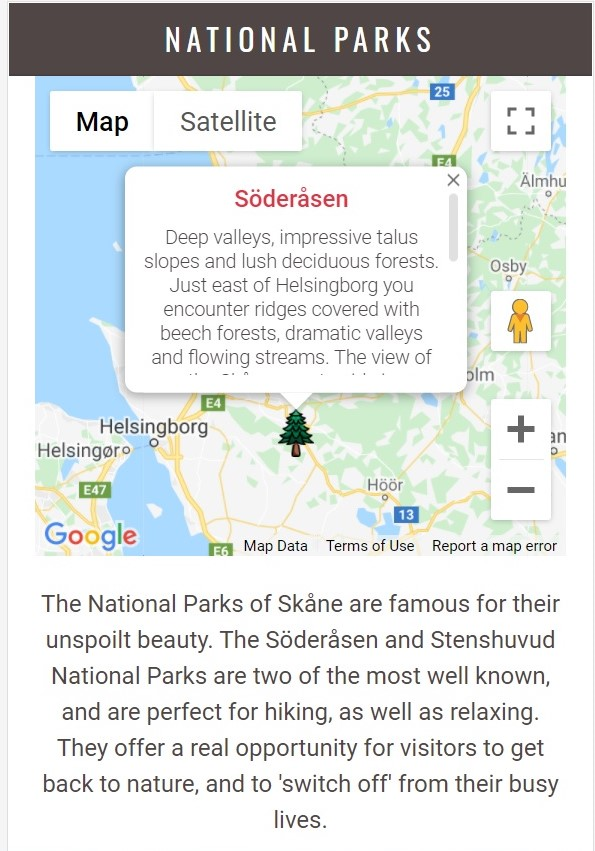
 
      - Screenshot of the 'National Parks' map with the Stenshuvud infowindow clearly displayed.

    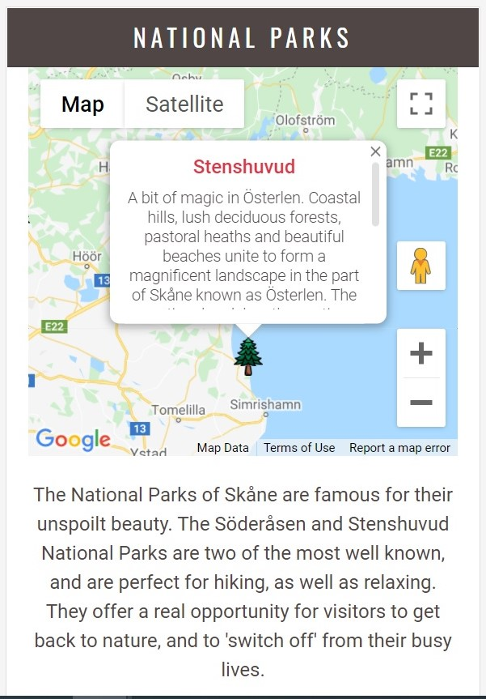

      - Screenshot of the 'Forests' map with the Häckeberga infowindow clearly displayed.

    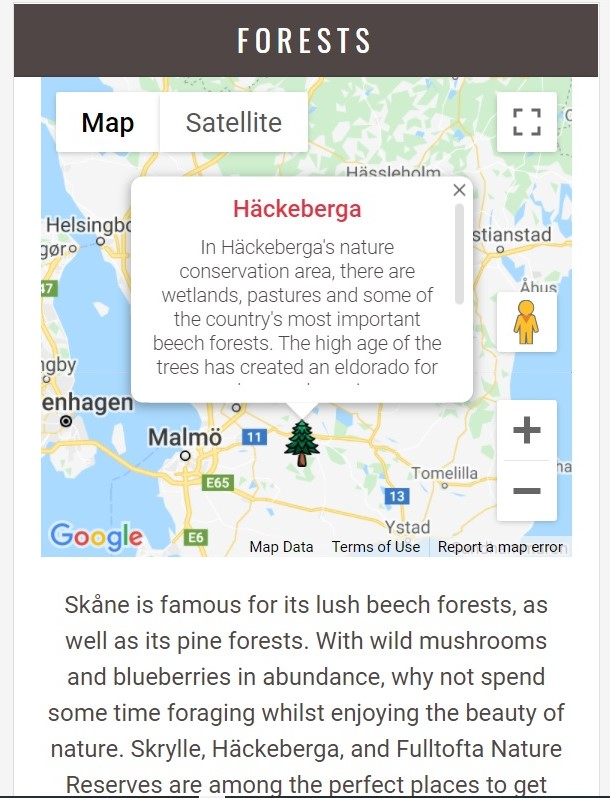

      - Screenshot of the 'Forests' map with the Fulltofta infowindow clearly displayed.
    

      - Screenshot of the 'Forests' map with the Skrylle infowindow clearly displayed.

    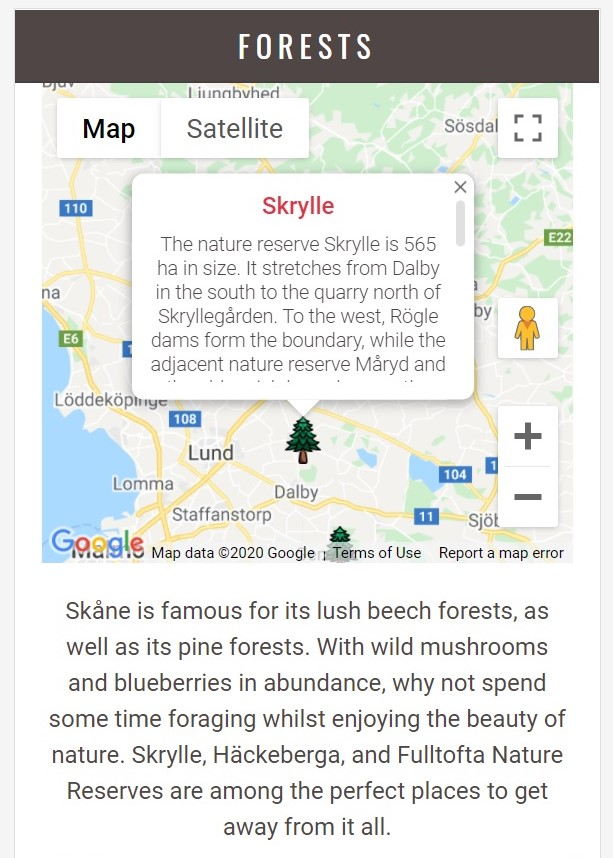

  - **Test Case 7**:
    - Ensure that each infowindow details information about recommended forests or National Parks in Skåne. 
  - **Expected Result**: Each infowindow will display information about a forest or a National Park in Skåne.
  - **Actual Result**: Each infowindow displays information about a forest or a National Park in Skåne.
  - **Pass/Fail**: Pass.
  
      - Screenshot of the Sö‎deråsen infowindow with information about the Sö‎deråsen National Park clearly displayed.
    
    

      - Screenshot of the Stenshuvud infowindow with information about the Stenshuvud National Park clearly displayed.

    

      - Screenshot of the Häckeberga infowindow with information about the Häckeberga forest clearly displayed.

    

      - Screenshot of the Häckeberga infowindow with information about the Fulltofta forest clearly displayed.

    

      - Screenshot of the Häckeberga infowindow with information about the Skrylle forest clearly displayed.

    

  - **Test Case 8**:
    - Ensure that the 'Attribution' link on each infowindow works, and takes the user to an external site, which opens in a
  new tab.
  - **Expected Result**: 'Attribution' links on each infowindow will take the user to an external site, which opens in a new tab.
  - **Actual Result**:  'Attribution' links on each infowindow take the user to external sites, which open in a new tab.
  - **Pass/Fail**: Pass.

      - Screenshot of the Sö‎deråsen 'Attribution' link.

    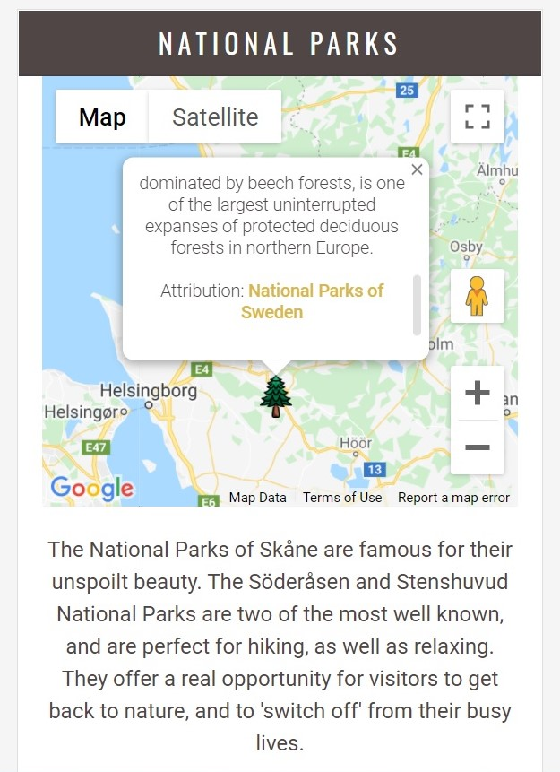

      - Screenshot of the Sö‎deråsen 'Attribution' link having opened an external site in a new tab.

    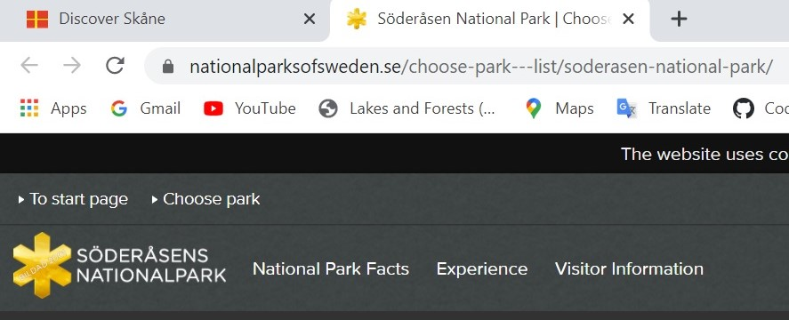

      - Screenshot of the Stenshuvud 'Attribution' link.

    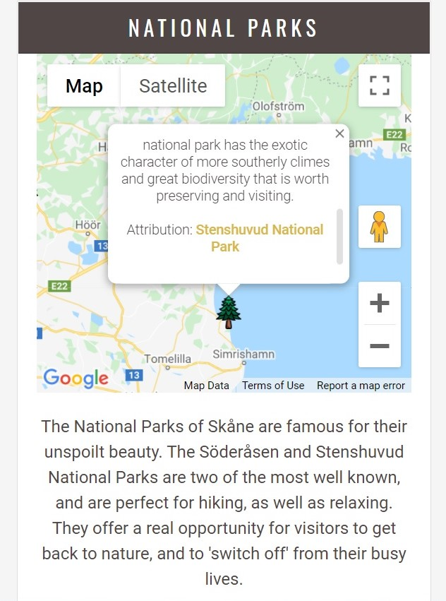

       - Screenshot of the Stenshuvud 'Attribution' link having opened an external site in a new tab.

    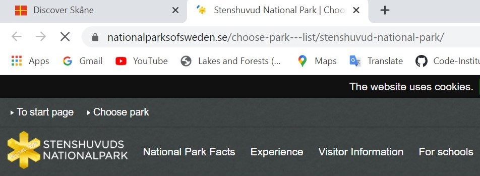

      - Screenshot of the Häckeberga 'Attribution' link.

    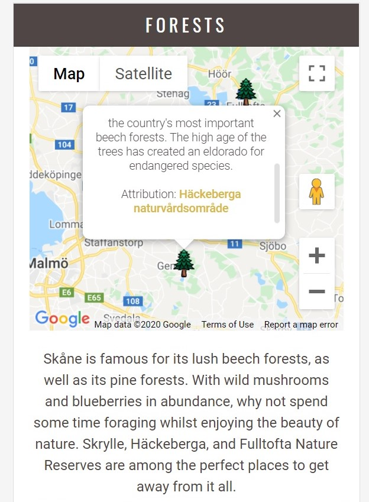

     - Screenshot of the Häckeberga 'Attribution' link having opened an external site in a new tab.

     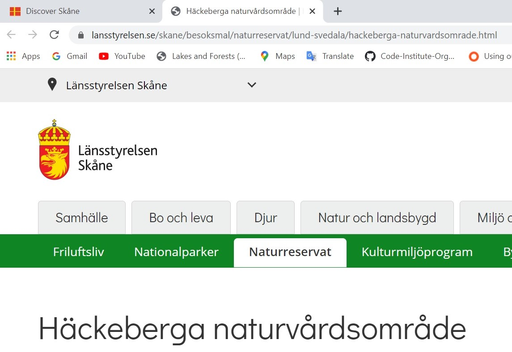

      - Screenshot of the Skrylle 'Attribution' link.

    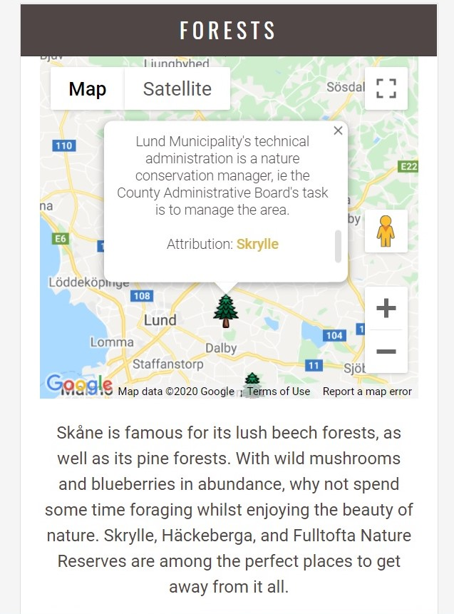

     - Screenshot of the Skrylle 'Attribution' link having opened an external site in a new tab.

    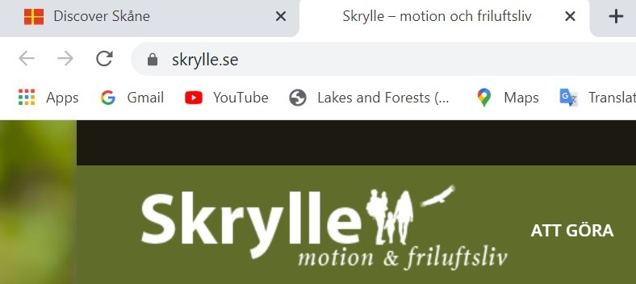

      - Screenshot of the Fulltofta 'Attribution' link.

    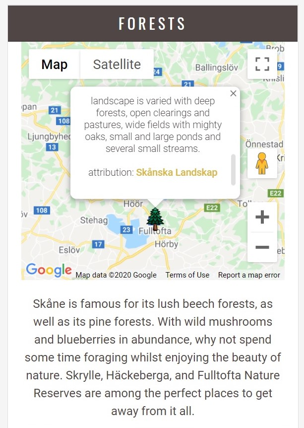

     - Screenshot of the Fulltofta 'Attribution' link having opened an external site in a new tab.

    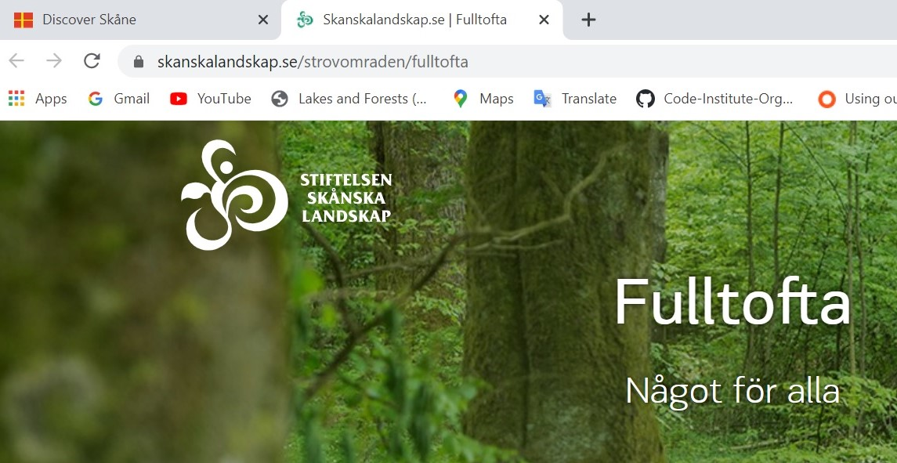

### Beautiful Beaches:

- User stories five and seven are concerned with finding beaches suitable for a seaside holiday. 

5. I have booked a holiday to Skåne, and I want to find out where there are some beaches, so that I can enjoy a seaside break.
7. I want to find out whether there are any nice beaches in Skåne, so that I know whether to book a beach holiday there.

- Navigate to the 'Beautiful Beaches' section of the website by clicking on the 'Beautiful Beaches' navbar link, or by scrolling down the page.
  
  - **Test Case 1**:
    - Ensure that the 'East Coast', 'West Coast' and 'South Coast' images show pictures of beaches. 
  - **Expected Result**: 'East Coast', 'West Coast' and 'South Coast' images will be visible.
  - **Actual Result**: 'East Coast', 'West Coast' and 'South Coast' images are visible.
  - **Pass/Fail**: Pass.
    
      - Screenshot of the 'Beautiful Beaches' cards with the images clearly visible.

    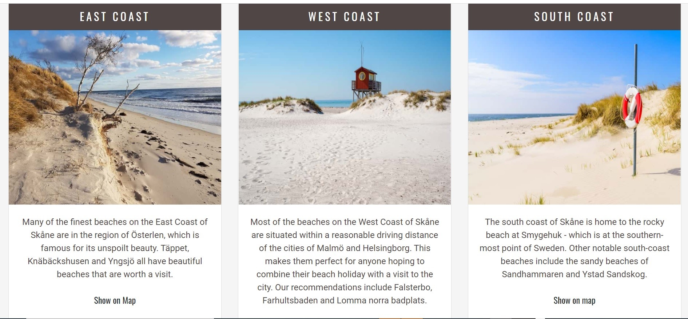

  - **Test Case 2**:
    - Ensure the that text below each image details some recommended beaches in Skåne.
  - **Expected Results**: Text below 'East Coast', 'West Coast and 'South Coast' images will be visible.
  - **Actual Results**: Text below 'East Coast', 'West Coast and 'South Coast' images is visible.
  - **Pass/Fail**: Pass.

      - Screenshot of the 'Beautiful Beaches' cards with the text below the images clearly visible. 

    

  - **Test Case 3**:
    - Ensure that when 'Show on Map is clicked, the map is visible, and the image is hidden. 
  - **Expected Result** When 'Show on Map' is clicked, the map will be visible, and the image will be hidden.
  - **Actual Result**: When 'Show on Map' is clicked, the map is visible, and the image is hidden.
  - **Pass/Fail**: Pass.
    
      - Screenshot of the 'East Coast' card, with the map clearly visible, after 'Show on Map' has been clicked.

    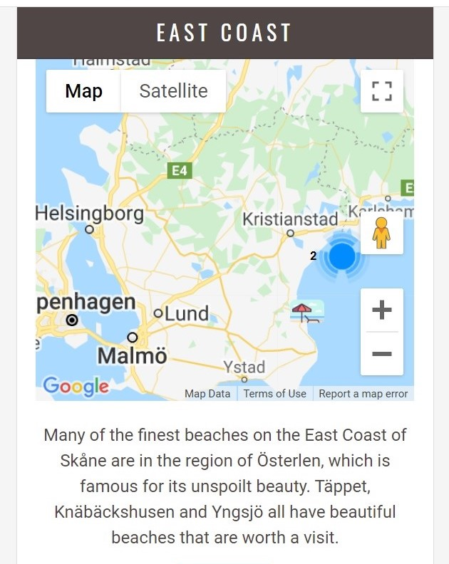

      - Screenshot of the 'West Coast' card, with the map clearly visible, after 'Show on Map' has been clicked.

    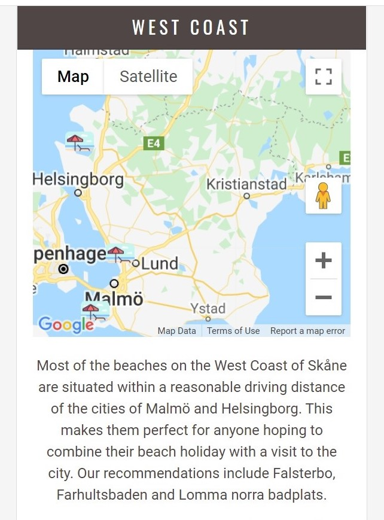

     - Screenshot of the 'South Coast' card, with the map clearly visible, after 'Show on Map' has been clicked.
 
    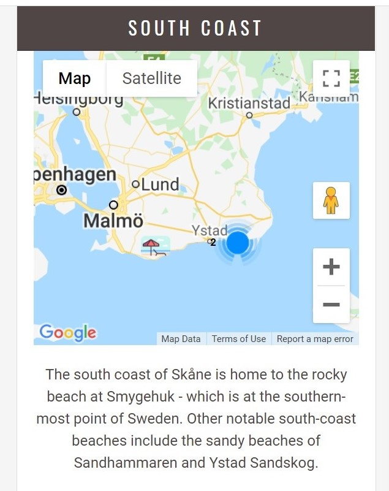

  - **Test Case 4**:
    - Ensure that when 'Hide Map is clicked, the map is hidden and the image is visible.
  - **Expected Result**: When 'Hide Map' is clicked, the map will be hidden, and the image will be visible.
  - **Actual Result**: When 'Hide Map' is clicked, the map is hidden, and the image is visible.
  - **Pass/Fail**: Pass.
  
     - Screenshot of the 'East Coast' card, with the image clearly visible, after 'Hide Map' has been clicked.

    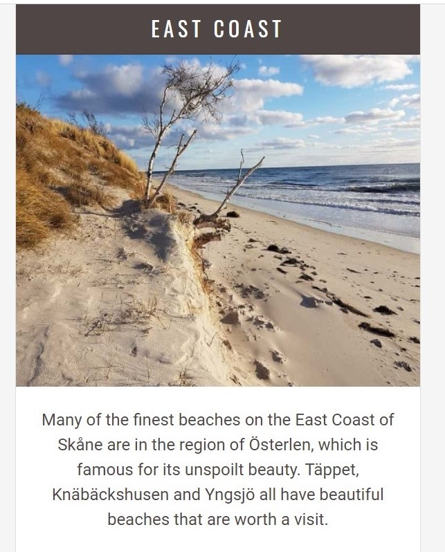

      - Screenshot of the 'West Coast' card, with the image clearly visible, after 'Hide Map' has been clicked.

    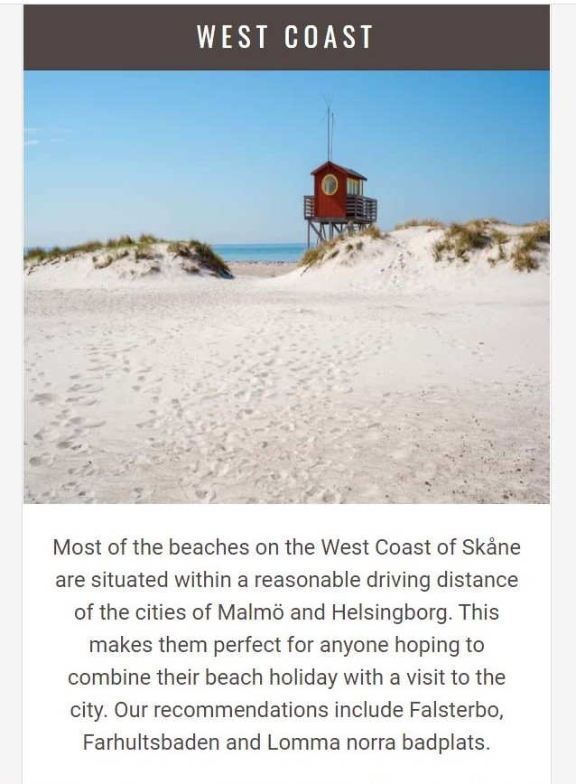   

    - Screenshot of the 'South Coast' card, with the image clearly visible, after 'Hide Map' has been clicked.

    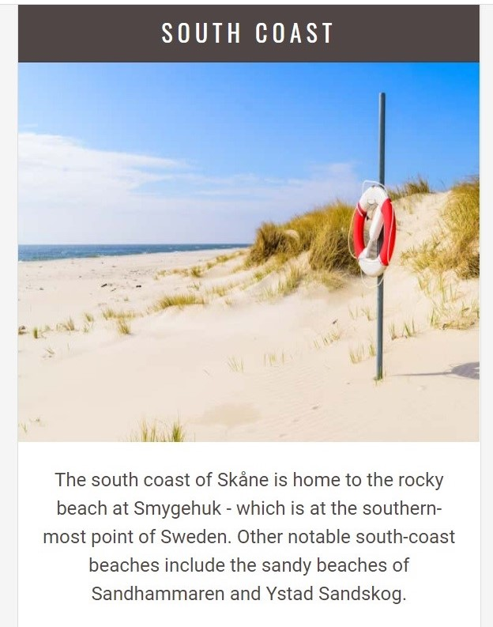   

  - **Test Case 5**: 
    - Ensure that there are custom markers on each map.
  - **Expected Result**: When maps are visible, custom markers will be displayed on them. Markers that are close together will be displayed as marker clusters.
  - **Actual Result**: When maps are visible, custom markers are displayed on them. Markers that are close together are displayed as marker clusters.
  - **Pass/Fail**: Pass.

      - Screenshot of the 'Beautiful Beaches' maps with custom markers and marker clusters clearly visible.

    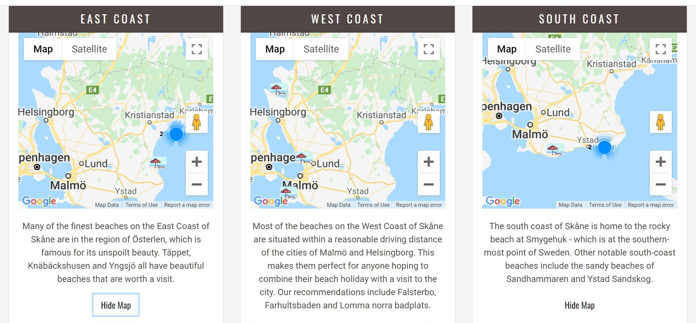

  - **Test Case 6**:
    - Ensure that when clicked, each marker will display an infowindow. 
  - **Expected Result**: Each marker will display an infowindow when clicked.
  - **Actual Result**: Each marker displays an infowindow when clicked.
  - **Pass/Fail**: Pass.

      - Screenshot of the 'East Coast' map with the Knäbäckshusen infowindow clearly displayed.

    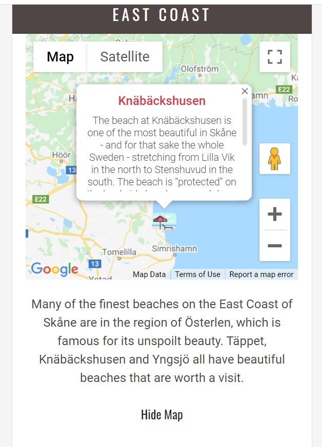

      - Screenshot of the 'East Coast' map with the Yngsjö infowindow clearly displayed.

    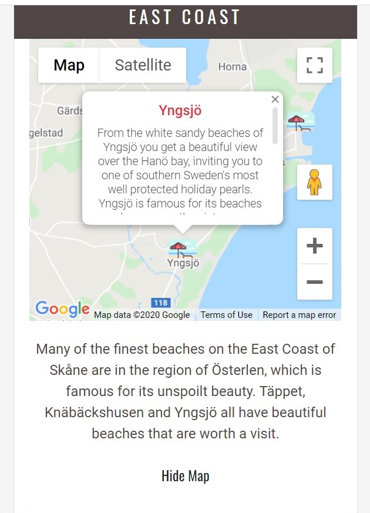

      - Screenshot of the 'East Coast' map with the Täppet infowindow clearly displayed.

    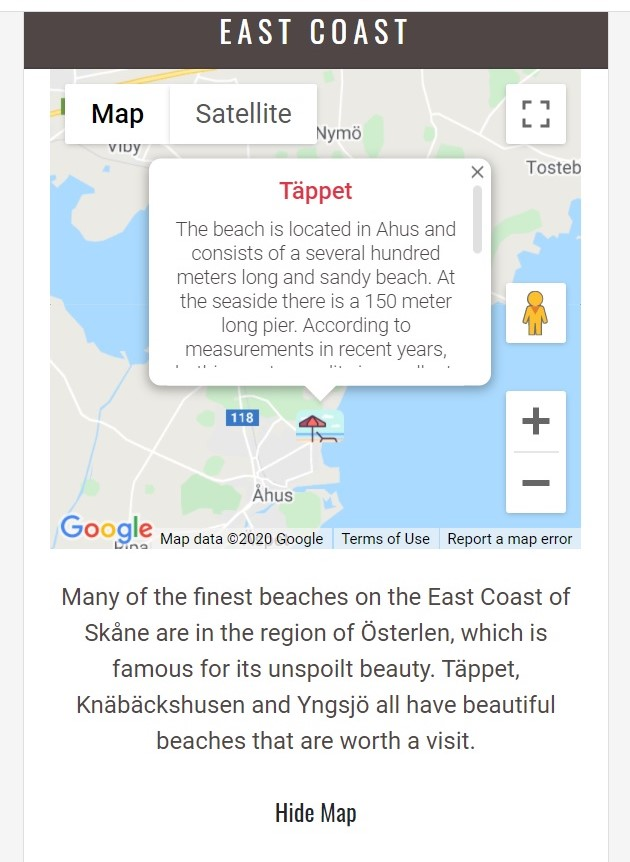>

      - Screenshot of the 'East Coast' map with the Farhultsbaden infowindow clearly displayed.

    

      - Screenshot of the 'East Coast' map with the Lomma Norra Badplats infowindow clearly displayed.

    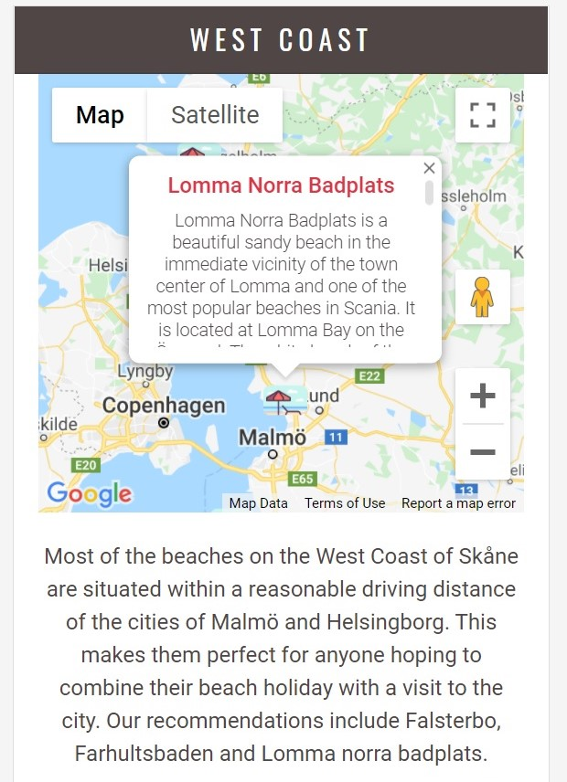

      - Screenshot of the 'East Coast' map with the Falsterbo infowindow clearly displayed.

    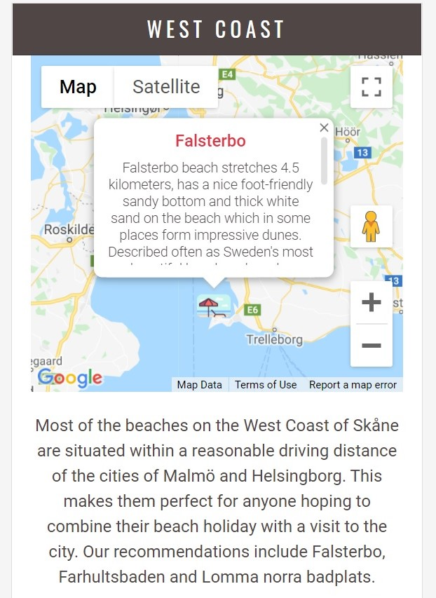

      - Screenshot of the 'East Coast' map with the Smygehuk infowindow clearly displayed.

    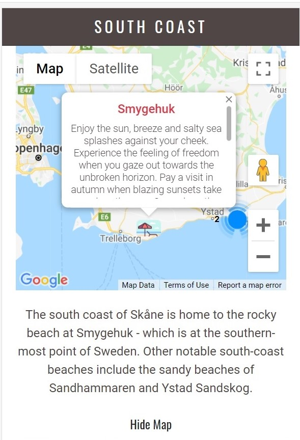

      - Screenshot of the 'East Coast' map with the Ystad Sandskog infowindow clearly displayed.

    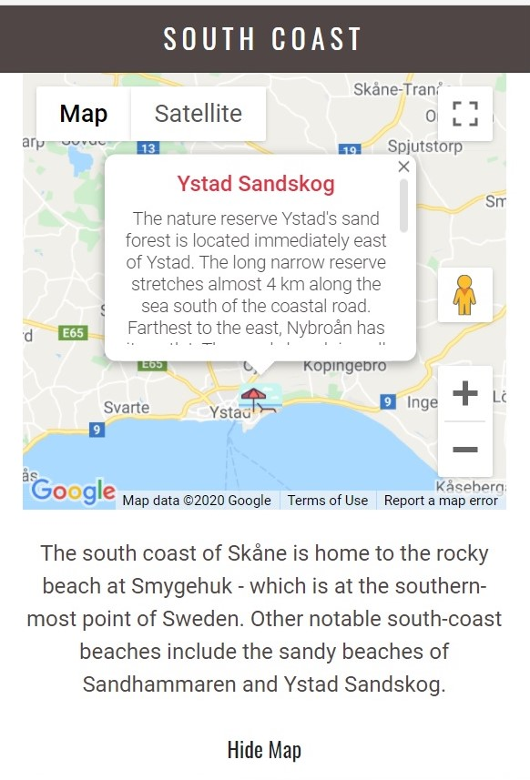

      - Screenshot of the 'East Coast' map with the Sandhammaren infowindow clearly displayed.

    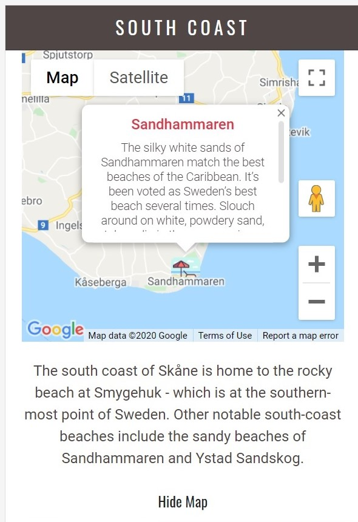

  - **Test Case 7**:
    - Ensure that each infowindow details information about recommended beaches in Skåne. 
  - **Expected Result**: Each infowindow will display information about a beach in Skåne.
  - **Actual Result**: Each infowindow displays information about a beach in Skåne.
  - **Pass/Fail**: Pass.

      - Screenshot of the 'East Coast' map with the Knäbäckshusen infowindow clearly displaying information about the beach.

    

      - Screenshot of the 'East Coast' map with the Yngsjö infowindow clearly displaying information about the beach.

    

      - Screenshot of the 'East Coast' map with the Täppet infowindow clearly displaying information about the beach.

    

      - Screenshot of the 'West Coast' map with the Farhultsbaden infowindow clearly displaying information about the beach.

    

      - Screenshot of the 'West Coast' map with the Lomma Norra Badplats infowindow clearly displaying information about the beach.

    

      - Screenshot of the 'West Coast' map with the Falsterbo infowindow clearly displaying information about the beach.

    

      - Screenshot of the 'South Coast' map with the Smygehuk infowindow clearly displaying information about the beach.

    

      - Screenshot of the 'South Coast' map with the Ystad Sandskog infowindow clearly displaying information about the beach.

    

      - Screenshot of the 'South Coast' map with the Sandhameren infowindow clearly displaying information about the beach.

    

  - **Test Case 8**:
    - Ensure that the 'Attribution' link on each infowindow works, and takes the user to an external site, which opens in a
  new tab.
  - **Expected Result**: 'Attribution' links on each infowindow will take the user to an external site, which opens in a new tab.
  - **Actual Result**: 'Attribution' links on each infowindow take the user to an external site, which opens in a new tab.
  - **Pass/Fail**: Pass.

      - Screenshot of the Knäbäckshusen infowindow with the 'Attribution' link clearly displayed.

    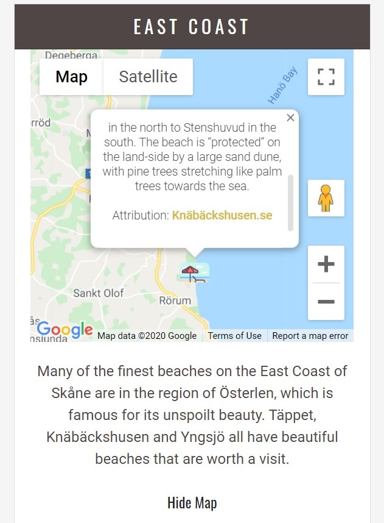

      - Screenshot of the Knäbäckshusen external site open in a new tab.

    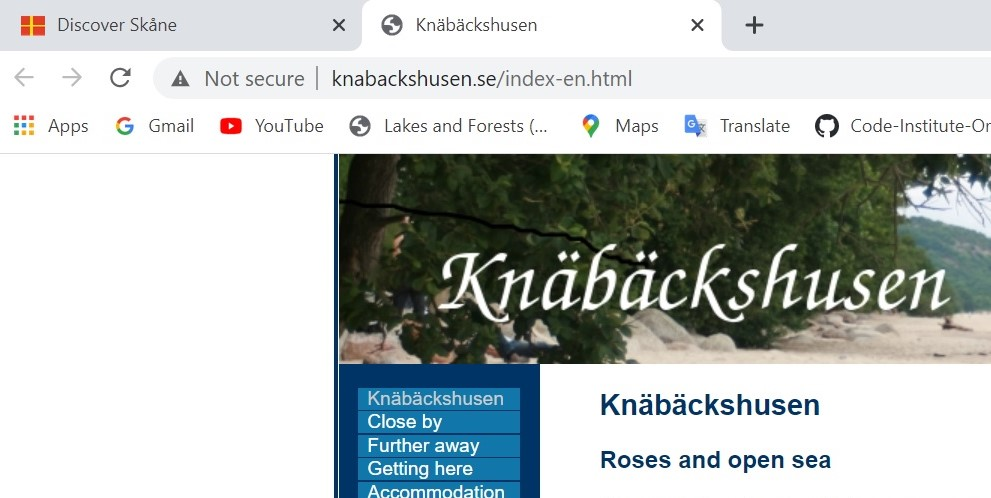

      - Screenshot of the Yngsjö Sandskog infowindow with the 'Attribution' link clearly displayed.

    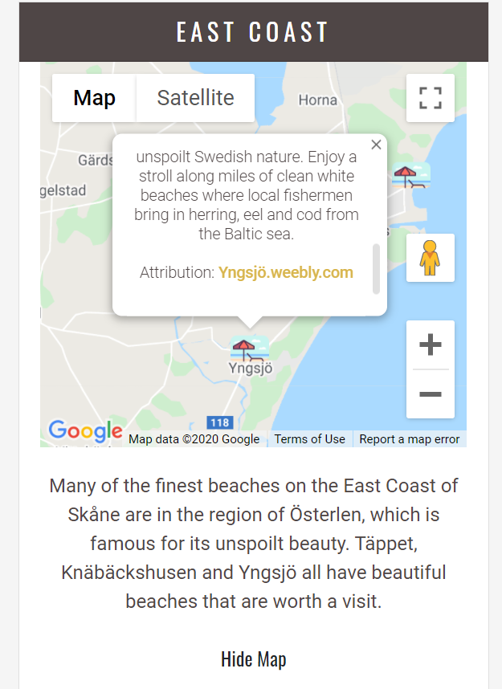

      - Screenshot of the Yngsjö Sandskog external site open in a new tab.

    

      - Screenshot of the Täppet infowindow with the 'Attribution' link clearly displayed.

    

      - Screenshot of the Täppet external site open in a new tab.

    

      - Screenshot of the Farhultsbaden infowindow with the 'Attribution' link clearly displayed.

    

      - Screenshot of the Farhultsbaden external site open in a new tab.

    

      - Screenshot of the Lomma Norra Badplats infowindow with the 'Attribution' link clearly displayed.

    

      - Screenshot of the Lomma Norra Badplats external site open in a new tab.

    

      - Screenshot of the Falsterbo infowindow with the 'Attribution' link clearly displayed.

    

       - Screenshot of the Falsterbo external site open in a new tab.

    

      - Screenshot of the Smygehuk infowindow with the 'Attribution' link clearly displayed.

    

      - Screenshot of the Smygehuk external site open in a new tab.  

    

      - Screenshot of the Ystad Sandskog infowindow with the 'Attribution' link clearly displayed. 

    

      - Screenshot of the Ystad Sandskog external site open in a new tab.

    

      - Screenshot of the Sandhammaren infowindow with the 'Attribution' link clearly displayed.

    

      - Screenshot of the Sandhammaren external site open in a new tab.

    

### City and Culture:

- User stories six and ten are concerned with cultural activities in the region.

6. I have booked a holiday to Skåne, and I want to find out where there are some cultural activities available, so that I can learn/see somehting new.
10. I want to know what kind of cultural activities there are in the largest cities in Skåne, so that I know whether to book a city break there.

- Navigate to the 'City and Culture' section of the website by clicking on 'City and Culture' on the navbar, or by scrolling down the page.
- **Test Case 1**:
  - Ensure that the 'Malmö', 'Helsingborg' and 'Lund' images show pictures of each city. 
- **Expected Result**: 'Malmö', 'Helsingborg' and 'Lund' images are visible.
- **Actual Result**: 'Malmö', 'Helsingborg' and 'Lund' images are visible.
- **Pass/Fail**: Pass.

- City and Culture cards with images clearly visible.


- **Test Case 2**:
  - Ensure the that text below each image details recommended cultural activities in Malmö, Helsingborg and Lund respectively. 
- **Expected Results**: Text below 'Malmö', 'Helsingborg' and 'Lund' images will be visible.
- **Actual Results**: Text below 'Malmö', 'Helsingborg' and 'Lund' images is visible.
- **Pass/Fail**: Pass.

- City and Culture cards with text below images clearly visible.  

- **Test Case 3**:
  - Ensure that when 'Show on Map is clicked, the map is visible, and the image is hidden. 
- **Expected Result** When 'Show on Map' is clicked, the map will be visible, and the image will be hidden.
- **Actual Result**: When 'Show on Map' is clicked, the map is visible, and the image is hidden.

- Screenshot of the 'Malmö' card, with the map clearly visible, after 'Show on Map' has been clicked.

- Screenshot of the 'Helsingborg' card, with the map clearly visible, after 'Show on Map' has been clicked.


- Screenshot of the 'Lund' card, with the map clearly visible, after 'Show on Map' has been clicked.  


- **Test Case 4**:
  - Ensure that when 'Hide Map is clicked, the map is hidden and the image is visible.
- **Expected Result**: When 'Hide Map' is clicked, the map will be hidden, and the image will be visible.
- **Actual Result**: When 'Hide Map' is clicked, the map is hidden, and the image is visible.
- **Pass/Fail**: Pass.

- Screenshot of the 'Malmö' card, with the image clearly visible, after 'Hide Map' has been clicked. 


- Screenshot of the 'Helsingborg' card, with the image clearly visible, after 'Hide Map' has been clicked. 


- Screenshot of the 'Lund' card, with the image clearly visible, after 'Hide Map' has been clicked. 

- **Test Case 5**:
  - Ensure that there are custom markers on each map. 
- **Expected Result**: When maps are visible, custom markers will be displayed on them. Markers that are close together will be displayed as marker clusters.
- **Actual Result**: When maps are visible, custom markers are displayed on them. Markers that are close together are displayed as marker clusters.
- **Pass/Fail**: Pass.

- Screenshot of the 'Malmö' map with custom markers and marker clusters clearly visible.

- Screenshot of the 'Helsingborg' map with custom markers and marker clusters clearly visible.

- Screenshot of the 'Lund' map with custom markers and marker clusters clearly visible. 

- **Test Case 6**:
  - Ensure that when clicked, each marker will display an infowindow. 
- **Expected Result**: Each marker will display an infowindow when clicked.
- **Actual Result**: Each marker displays an infowindow when clicked.
- **Pass/Fail**: Pass.

- Screenshot of the 'Malmö' map with the Disgusting Food Museum infowindow clearly visible.

- Screenshot of the 'Malmö' map with the Malmö Opera infowindow clearly visible.


- Screenshot of the 'Malmö' map with the Malmö Castle infowindow clearly visible.


- Screenshot of the 'malmo' map with the Malmö Concert House infowindow clearly visible.


- Screenshot of the 'Helsingborg' map with the Sofiero infowindow clearly visible.

- Screenshot of the 'Helsingborg' map with the Helsingborg Concert House infowindow clearly visible.


- Screenshot of the 'Helsingborg' map with the Dunkers Culture House infowindow clearly visible.


- Screenshot of the 'Lund' map with the Kulturen infowindow clearly visible.


- Screenshot of the 'Lund' map with the Lund Cathedral infowindow clearly visible.


- Screenshot of the 'Lund' map with the Lund Planetarium infowindow clearly visible.


- **Test Case 7**:
  - Ensure that each infowindow details information about recommended cultural activities in Malmö, Helsingborg and Lund. 
- **Expected Result**: Each infowindow will display information about recommended cultural activities in Malmö, Helsingborg and Lund.
- **Actual Result**:  Each infowindow displays information about recommended cultural activities in Malmö, Helsingborg and Lund.
- **Pass/Fail**: Pass.

- Screenshot of the 'Malmö' map with the Disgusting Food Museum infowindow clearly displaying information about the location.

- Screenshot of the 'Malmö' map with the Malmö Opera infowindow clearly displaying information about the location.

- Screenshot of the 'Malmö' map with the Malmö Castle infowindow clearly displaying information about the location.

      
- Screenshot of the 'Malmö' map with the Malmö Concert House infowindow clearly displaying information about the location.
    

- Screenshot of the 'Helsingborg' map with the Sofiero infowindow clearly displaying information about the location.

- Screenshot of the 'Helsingborg' map with the Helsingborg Concert House infowindow clearly displaying information about the location.

- Screenshot of the 'Helsingborg' map with the Dunkers Culture House infowindow clearly displaying information about the location.
    

- Screenshot of the 'Lund' map with the Kulturen infowindow clearly displaying information about the location.

- Screenshot of the 'Lund' map with the Lund Cathedral infowindow clearly displaying information about the location.

- Screenshot of the 'Lund' map with the Lund Planetarium infowindow clearly displaying information about the location.

- **Test Case 8**:
  - Ensure that the 'Attribution' link on each infowindow works, and takes the user to an external site, which opens in a
  new tab.
- **Expected Result**: The 'Attribution' link will navigate to an external site, which opens in a new tab.
- **Actual Result**: The 'Attribution' link navigates to an external site, which opens in a new tab.
- **Pass/Fail**: Pass.

- Screenshot of the Malmö Concert House infowindow with the 'Attribution' link clearly displayed.


- Screenshot of the Malmö Concert House external site open in a new tab.


- Screenshot of the Malmö Castle infowindow with the 'Attribution' link clearly displayed.


- Screenshot of the Malmö Castle external site open in a new tab.

- Screenshot of the Malmö Opera infowindow with the 'Attribution' link clearly displayed.


- Screenshot of the Malmö Opera external site open in a new tab.


- Screenshot of the Sofiero infowindow with the 'Attribution' link clearly displayed.


- Screenshot of the Sofiero external site open in a new tab.


- Screenshot of the Helsingborg Concert House infowindow with the 'Attribution' link clearly displayed.


- Screenshot of the Helsingborg Concert House external site open in a new tab.


- Screenshot of the Kulturen infowindow with the 'Attribution' link clearly displayed.


- Screenshot of the Kulturen external site open in a new tab.


- Screenshot of the Lund Cathedral infowindow with the 'Attribution' link clearly displayed.


- Screenshot of the Lund Cathedral external site open in a new tab.


- Screenshot of the Lund Planetarium infowindow with the 'Attribution' link clearly displayed.


- Screenshot of the Lund Planetarium external site open in a new tab.

    
### Book: 

11. I want to find some hotel deals, so that I can book my holiday in Skåne.

- Navigate to the 'Book' section of the website.
  - **Test Case 1**:
    - Ensure that the 'Booking.com' Dealfinder renders, and displays a selection of hotel deals in Skåne.
  - **Expected Result**: The 'Booking.com' Dealfinder API will render, and a selection of available hotels in Skåne
  will be visible.
  - **Actual Result**: The 'Booking.com' Dealfinder API renders, and a selection of available hotels in Skåne
  is visible.

- Screenshot of the Booking.com Dealfinder API clearly visible on the page.


  
  - **Test Case 2**:
    - Ensure that when clicked, the 'See All Deals' button takes the user to an external site, which opens in a new tab.
  - **Expected Result**: The 'See All Deals' button will take users to the 'Booking.com' site, which will open in a new tab.
  - **Actual Result**: The 'See All Deals' button takes users to the 'Booking.com' site, which opens in a new tab.
  - **Pass/Fail**: Pass.

- Screenshot of the Booking.com site open in a new tab.

### Map:

12. I want to view all the recommended places to visit in Skåne on one map, so that I know where they all are in relation to one another. I also want to be able to
search the map to find additional locations.

- Navigate to the 'Map' section of the website by clicking on 'Map' on the navbar, or by scrolling down the page.

- **Test Case 1**:
  - Ensure that Google Maps API map renders.
- **Expected Result**: Google map should be visible.
- **Actual Result**: Google map is visible.
- **Pass/Fail**: Pass.
    
- Screenshot of Google Maps API map.

- **Test Case 2**: 
  - Ensure that all custom markers are visible on the map.
- **Expected Result**: All custom markers will be visible. When markers are close together, they will appear as a marker cluster.
- **Actual Result**: All custom markers are visible. When markers are close together, they appear as a marker cluster.
- **Pass/Fail**: Pass.

- Screenshot of the Google Maps API map with custom markers and marker clusters clearly visible.

- **Test Case 3**:
  - Ensure that all custom markers open infowindows when clicked.
- **Expected Result**: All custom markers will open an infowindow when clicked.
- **Actual Result**: All custom markers open an infowindow when clicked.
- **Pass/Fail**: Pass.

- Screenshot of the 'Disgusting Food Museum' infowindow.


- Screenshot of the 'Dunkers Cultre House' infowindow.


- Screenshot of the 'Falsterbo' infowindow.


- Screenshot of the 'Farhultsbaden' infowindow.


- Screenshot of the 'Fulltofta' infowindow.


- Screenshot of the 'Häckeberga' infowindow.


      
- Screenshot of the 'Hammarsjön' infowindow.

   

- Screenshot of the 'Helsingborg Concert House' infowindow.

   

- Screenshot of the 'Helsingborg' infowindow.


- Screenshot of the 'Hjälmsjön' infowindow.

 

- Screenshot of the 'Knäbäckshusen' infowindow.

   

- Screenshot of the 'Kulturen' infowindow.


- Screenshot of the 'Lake Immeln' infowindow.

 

- Screenshot of the 'Lomma Norra Badplats' infowindow.

  

- Screenshot of the 'Lund Cathedral' infowindow.

 

- Screenshot of the 'Lund' infowindow.

  

- Screenshot of the 'Lund' infowindow.

 

- Screenshot of the 'Lund Planetarium' infowindow.

 

- Screenshot of the 'Malmö Castle' infowindow.

 

- Screenshot of the 'Malmö Concert House' infowindow.


- Screenshot of the 'Malmö' infowindow.


- Screenshot of the 'Malmö Opera' infowindow.


- Screenshot of the 'Sandhameren' infowindow.


- Screenshot of the 'Skrylle' infowindow.


- Screenshot of the 'Smygehuk' infowindow.


- Screenshot of the 'Sö‎deråsen' infowindow.


- Screenshot of the 'Sofiero' infowindow.


- Screenshot of the 'Stenshuvud' infowindow.


- Screenshot of the 'Täppet' infowindow.


- Screenshot of the 'Yngsjö' infowindow.


- Screenshot of the 'Ystad Sandskog' infowindow.


- **Test Case 4**: 
  - Ensure that all infowindows display relevant information about their location.
- **Expected Result**: All infowindows will display relevant information about their location.
- **Actual Result**: All infowindows display relevant information about their location.
- **Pass/Fail**: Pass.

- Screenshot of the 'Disgusting Food Museum' infowindow with information clearly displayed about the location.

- Screenshot of the 'Dunkers Cultre House' infowindow with information clearly displayed about the location.

- Screenshot of the 'Falsterbo' infowindow with information clearly displayed about the location.

- Screenshot of the 'Farhultsbaden' infowindow with information clearly displayed about the location.

- Screenshot of the 'Fulltofta' infowindow with information clearly displayed about the location.

- Screenshot of the 'Häckeberga' infowindow with information clearly displayed about the location.

  

- Screenshot of the 'Hammarsjön' infowindow with information clearly displayed about the location.

    

- Screenshot of the 'Helsingborg Concert House' infowindow with information clearly displayed about the location.

   

- Screenshot of the 'Helsingborg' infowindow with information clearly displayed about the location.

  

- Screenshot of the 'Hjälmsjön' infowindow with information clearly displayed about the location.

  

- Screenshot of the 'Knäbäckshusen' infowindow with information clearly displayed about the location.

   

- Screenshot of the 'Kulturen' infowindow with information clearly displayed about the location.

- Screenshot of the 'Lake Immeln' infowindow with information clearly displayed about the location.

  

- Screenshot of the 'Lomma Norra Badplats' infowindow with information clearly displayed about the location.

 

- Screenshot of the 'Lund Cathedral' infowindow with information clearly displayed about the location.

  

- Screenshot of the 'Lund' infowindow with information clearly displayed about the location.

  

- Screenshot of the 'Lund Planetarium' infowindow with information clearly displayed about the location.

  

- Screenshot of the 'Malmö Castle' infowindow with information clearly displayed about the location.

  

- Screenshot of the 'Malmö Concert House' infowindow with information clearly displayed about the location.

- Screenshot of the 'Malmö' infowindow with information clearly displayed about the location.

- Screenshot of the 'Malmö Opera' infowindow with information clearly displayed about the location.

- Screenshot of the 'Sandhameren' infowindow with information clearly displayed about the location.

- Screenshot of the 'Skrylle' infowindow with information clearly displayed about the location.

- Screenshot of the 'Smygehuk' infowindow with information clearly displayed about the location.

- Screenshot of the 'Sö‎deråsen' infowindow with information clearly displayed about the location.

- Screenshot of the 'Sofiero' infowindow with information clearly displayed about the location.

- Screenshot of the 'Stenshuvud' infowindow with information clearly displayed about the location.

- Screenshot of the 'Täppet' infowindow with information clearly displayed about the location.

- Screenshot of the 'Yngsjö' infowindow with information clearly displayed about the location.

- Screenshot of the 'Ystad Sandskog' infowindow with information clearly displayed about the location.

- **Test Case 5**: 
  - Ensure that 'Attribution' links navigate to external sites when clicked, and that they open in new tabs.
- **Expected Result**: All 'Attribution' links will navigate to external sites, which open in new tabs.
- **Actual Result**: All 'Attribution' links navigate to external sites, which open in new tabs.

    Whilst screenshots of the 'Attribution' links are provided, the developer deemed it unnecessary to provide screenshots
    of the external sites open in new tabs, as the code is the same for the main map markers as it is for the smaller maps further 
    up the page. Therefore, providing that the markers are visible on the map, the 'Attribution' link will work exactly as it does in 
    all other instances.

    - Screenshot of the 'Disgusting Food Museum' infowindow with the 'Attribution' link clearly displayed.

    

    - Screenshot of the 'Dunkers Cultre House' infowindow with the 'Attribution' link clearly displayed.

    

    - Screenshot of the 'Falsterbo' infowindow with the 'Attribution' link clearly displayed.

    

    - Screenshot of the 'Farhultsbaden' infowindow with the 'Attribution' link clearly displayed.

    

    - Screenshot of the 'Fulltofta' infowindow with the 'Attribution' link clearly displayed.

    

    - Screenshot of the 'Häckeberga' infowindow with the 'Attribution' link clearly displayed.

       

    - Screenshot of the 'Hammarsjön' infowindow with the 'Attribution' link clearly displayed.

     

    - Screenshot of the 'Helsingborg Concert House' infowindow with the 'Attribution' link clearly displayed.

      

    - Screenshot of the 'Helsingborg' infowindow with the 'Attribution' link clearly displayed.

    

    - Screenshot of the 'Hjälmsjön' infowindow with the 'Attribution' link clearly displayed.

      

    - Screenshot of the 'Knäbäckshusen' infowindow with the 'Attribution' link clearly displayed.

     

    - Screenshot of the 'Kulturen' infowindow with the 'Attribution' link clearly displayed.

     

    - Screenshot of the 'Lake Immeln' infowindow with the 'Attribution' link clearly displayed.

     

    - Screenshot of the 'Lomma Norra Badplats' infowindow with the 'Attribution' link clearly displayed.

    

    - Screenshot of the 'Lund Cathedral' infowindow with the 'Attribution' link clearly displayed.

    

    - Screenshot of the 'Lund' infowindow with the 'Attribution' link clearly displayed.

    

    - Screenshot of the 'Lund Planetarium' infowindow with the 'Attribution' link clearly displayed.

    

    - Screenshot of the 'Malmö Castle' infowindow with the 'Attribution' link clearly displayed.

     

    - Screenshot of the 'Malmö Concert House' infowindow with the 'Attribution' link clearly displayed.

    

    - Screenshot of the 'Malmö' infowindow with the 'Attribution' link clearly displayed.

    

    - Screenshot of the 'Malmö Opera' infowindow with the 'Attribution' link clearly displayed.

    

    - Screenshot of the 'Sandhameren' infowindow with the 'Attribution' link clearly displayed.

    

    - Screenshot of the 'Skrylle' infowindow with the 'Attribution' link clearly displayed.

    

    - Screenshot of the 'Smygehuk' infowindow with the 'Attribution' link clearly displayed.

    

    - Screenshot of the 'Sö‎deråsen' infowindow with the 'Attribution' link clearly displayed.

    

    - Screenshot of the 'Sofiero' infowindow with the 'Attribution' link clearly displayed.

    

    - Screenshot of the 'Stenshuvud' infowindow with the 'Attribution' link clearly displayed.

    

    - Screenshot of the 'Täppet' infowindow with the 'Attribution' link clearly displayed.

    

    - Screenshot of the 'Yngsjö' infowindow with the 'Attribution' link clearly displayed.

    

    - Screenshot of the 'Ystad Sandskog' infowindow with the 'Attribution' link clearly displayed.

    

- **Test Case 5**: 
  - Ensure that the searchbox functions correctly, and that the results of the search carried out are displayed on the map.
- **Expected Result**: When locations are searched for in the searchbox, they will be displayed on the map.
- **Actual Result**: When locations are searched for in the searchbox, they are displayed on the map.
- **Pass/Fail**: Pass.

    - Screenshot of the searchbox with location submitted, and location displayed on the map.

    

### Contact: 

13. I want to get in touch with the site owner so that I can recommend more places to visit in Skåne.

- **Test Case 1**:
- Ensure that the contact form is visible and behaves as expected.
- Navigate to the 'Book' section of the page.
- Ensure that the contact form is visible and displays the following fields:
    - 'Name' 
    - 'Email'
    - 'Your recommendations'

- Screenshot of the contact form.


- Enter the following data into form fields:
    - Your name.
    - your email in the following format: name@host.com.
    - Your recommendations (text input)
    - Click 'Submit'
    - Ensure alert box appears with the following message: "Thank you. Your email has been sent. We'll get back to you as soon as we can!"
  
  - **Expected Result**: Form submits without errors, and alert box confirms submission.
  - **Actual Result**: Form submits without errors, and alert box confirms sbmission.
  - **Pass/Fail**: Pass.

- Screenshot of the submitted form with alert box confirming submission.


  
- **Test Case 2**:

    - Ensure that Contact Form cannot be submitted with any blank fields, or with an email address that doesn't contain @.
- **Expected Result**: Form will not submit unless filled out correctly.
- **Actual Result**: Form will not submit unless filled out correctly.
- **Pass/Fail**: Pass
    - Screenshot of the Contact Form with the 'Name' field left blank when submit is clicked.


- Screenshot of the contact form with the email field blank when submit is clicked.


- Screenshot of the contact form with the email field without an '@' sign when submit is clicked.


- Screenshot of the contact form with a blank 'suggestions' field when submit is clicked.


## Testing the Swedish content:

- **Test Case 1**:

- Ensure that all text is displayed in Swedish once the Swedish flag is clicked.

- Screenshot of the Navbar in Swedish.


- Screenshot of the introduction in Swedish.


- Screenshot of the Lakes and Forests Header and Card Tops in Swedish.


- Screenshot of the Lakes and Forests text and scroll to top button in Swedish.


- Screenshot of the Beautiful Beaches Header and Card Tops in Swedish.


- Screenshot of the Beautiful Beaches text and scroll to top button in Swedish.


- Screenshot of the City and Culture Header and card topsin Swedish.


- Screenshot of the City and Culture text and scroll to top button in Swedish.


- Screenshot of the Map header and Search the Map text in Swedish.


- Screenshots of the infowindows with the text in Swedish. 
  
  The developer thought it unnecessary to provide screnshots of the infowindows on the smaller maps as the 
  code is the same for the main map markers as it is for the smaller maps further 
  up the page. Therefore, providing that the markers are visible on the map, the infowindow will work exactly as it does in 
  all other instances. 

- Screenshot of the Disgusting Food Museum infowindow with the text in Swedish.


- Screenshot of the Dunkers Cultre House infowindow with the text in Swedish.


- Screenshot of the Falsterbo infowindow with the text in Swedish.

- Screenshot of the Farhultsbaden infowindow with the text in Swedish.


- Screenshot of the Fulltofta infowindow with the text in Swedish.


- Screenshot of the Häckeberga infowindow with the text in Swedish.


- Screenshot of the Hammarsjön infowindow with the text in Swedish.


- Screenshot of the Helsingborg infowindow with the text in Swedish.


- Screenshot of the Helsingborg Concert House infowindow with the text in Swedish.


- Screenshot of the Hjälmsjön infowindow with the text in Swedish.


- Screenshot of the Knäbäckshusen infowindow with the text in Swedish.


 
- Screenshot of the Kulturen infowindow with the text in Swedish.


- Screenshot of the Lake Immeln infowindow with the text in Swedish.


- Screenshot of the Lomma Norra Badplats infowindow with the text in Swedish.


- Screenshot of the Lund infowindow with the text in Swedish.


- Screenshot of the Lund Cathedral infowindow with the text in Swedish.


- Screenshot of the Lund Planetarium infowindow with the text in Swedish.


- Screenshot of the Malmö infowindow with the text in Swedish.


- Screenshot of the Malmö Castle infowindow with the text in Swedish.


- Screenshot of the Malmö Concert Hall infowindow with the text in Swedish.


- Screenshot of the Malmö Opera infowindow with the text in Swedish.


- Screenshot of the Sandhammaren infowindow with the text in Swedish.


- Screenshot of the Skrylle infowindow with the text in Swedish.


  
- Screenshot of the Smygehuk infowindow with the text in Swedish.


- Screenshot of the Sö‎deråsen infowindow with the text in Swedish.


- Screenshot of the Sofiero infowindow with the text in Swedish.


- Screenshot of the Stenshuvud infowindow with the text in Swedish.


- Screenshot of the Täppet infowindow with the text in Swedish.


- Screenshot of the Yngsjö infowindow with the text in Swedish.


- Screenshot of the Ystad Sandskog infowindow with the text in Swedish.


- Screenshot of the Book header and text in Swedish.


- Screenshot of the Contact header, text and contact form in Swedish.

## Manual Browser Compatibility Testing:

- Manual testing was carried out across a variety of browsers. The results are detailed below. To download the tests as an Excel document, 
click here.

|              |                   |                                                                                                                              | Windows 10 Home Edition version 1909. 64 bit. |         |       |                |                   | MacOS High Sierra Version 10.13.6 | Apple iPhone       |
|--------------|-------------------|------------------------------------------------------------------------------------------------------------------------------|-----------------------------------------------|---------|-------|----------------|-------------------|-----------------------------------|--------------------|
| Page         | Section           | Test                                                                                                                         | Chrome                                        | Firefox | Opera | Microsoft Edge | Internet Explorer | Safari (Version 13.1.2)           | iOS (Version 14.1) |
| Landing Page | N/A               | Verify Hero Image Loads                                                                                                      | Pass                                          | Pass    | Pass  | Pass           | Pass              | Pass                              | Pass               |
| Landing Page | N/A               | Verify Hero Image is good quality and not pixelated                                                                          | Pass                                          | Pass    | Pass  | Pass           | Pass              | Pass                              | Pass               |
| Landing Page | N/A               | Verify Title Loads                                                                                                           | Pass                                          | Pass    | Pass  | Pass           | Pass              | Pass                              | Pass               |
| Landing Page | N/A               | Verify 'Enter' button changes from red/yellow to red/white on hover                                                          | Pass                                          | Pass    | Pass  | Pass           | Pass              | Pass                              | Pass               |
| Landing Page | N/A               | Verify 'Enter' button takes user to 'Main Content' when clicked                                                              | Pass                                          | Pass    | Pass  | Pass           | Pass              | Pass                              | Pass               |
| Main Content | Hero Image        | Verify Hero Image Loads                                                                                                      | Pass                                          | Pass    | Pass  | Pass           | pass              | Pass                              | Pass               |
|              |                   | Verify Hero Image is good quality and not pixelated                                                                          | Pass                                          | Pass    | Pass  | Pass           | pass              | Pass                              | Pass               |
|              |                   | Verify title loads                                                                                                           | Pass                                          | Pass    | Pass  | Pass           | pass              | Pass                              | Pass               |
|              |                   | Verify that header and enter button are aligned and in the centre of the page                                                | Pass                                          | Pass    | Pass  | Pass           | fail              | Pass                              | Pass               |
|              | Navbar            | Verify all Navbar elements are Present (Lakes and Forests, Beautiful Beaches, City and Culture, Map, Book, Contact and Flag) | Pass                                          | Pass    | Pass  | Pass           | pass              | Pass                              | Pass               |
|              |                   | Verify 'Lakes and Forests' link takes the user to the correct section                                                        | Pass                                          | Pass    | Pass  | Pass           | pass              | Pass                              | Pass               |
|              |                   | Verify 'Beautiful Beaches' link takes the user to the correct section                                                        | Pass                                          | Pass    | Pass  | Pass           | pass              | Pass                              | Pass               |
|              |                   | Verify 'City and Culture' link takes the user to the correct section                                                         | Pass                                          | Pass    | Pass  | Pass           | pass              | Pass                              | Pass               |
|              |                   | Verify 'Map' link takes the user to the correct section                                                                      | Pass                                          | Pass    | Pass  | Pass           | pass              | Pass                              | Pass               |
|              |                   | Verify 'Book' link takes the user to the correct section                                                                     | Pass                                          | Pass    | Pass  | Pass           | pass              | Pass                              | Pass               |
|              |                   | Verify 'Contact' link takes the user to the correct section                                                                  | Pass                                          | Pass    | Pass  | Pass           | pass              | Pass                              | Pass               |
|              |                   | Verify Swedish flag changes content to Swedish language                                                                      | Pass                                          | Pass    | Pass  | Pass           | pass              | Pass                              | Pass               |
|              |                   | Verify British flag changes content to English language                                                                      | Pass                                          | Pass    | Pass  | Pass           | pass              | Pass                              | Pass               |
|              | Intro Text        | Verify title is displayed                                                                                                    | Pass                                          | Pass    | Pass  | Pass           | pass              | Pass                              | Pass               |
|              |                   | Verify content is displayed                                                                                                  | Pass                                          | Pass    | Pass  | Pass           | pass              | Pass                              | Pass               |
|              |                   | Verify content and title changes from English language to Swedish language when the Swedish flag is clicked                  | Pass                                          | Pass    | Pass  | Pass           | pass              | Pass                              | Pass               |
|              |                   | Verify content and title changes from Swedish language to English language when the British flag is clicked                  | Pass                                          | Pass    | Pass  | Pass           | pass              | Pass                              | Pass               |
|              | Lakes andForests  | Verify Section Header image loads                                                                                            | Pass                                          | Pass    | Pass  | Pass           | Pass              | Pass                              | Pass               |
|              |                   | Verify Section Header image is good quality and not pixelated                                                                | Pass                                          | Pass    | Pass  | Pass           | pass              | Pass                              | Pass               |
|              |                   | Verify Card Titles load correctly                                                                                            | Pass                                          | Pass    | Pass  | Pass           | fail              | Pass                              | Pass               |
|              |                   | Verify Card Images load                                                                                                      | Pass                                          | Pass    | Pass  | Pass           | fail              | Pass                              | Pass               |
|              |                   | Verify Card Images are appropriate in size and not pixelated                                                                 | Pass                                          | Pass    | Pass  | Pass           | fail              | Pass                              | Pass               |
|              |                   | Verify maps display when 'Show on Map' is clicked                                                                            | Pass                                          | Pass    | Pass  | Pass           | fail              | Pass                              | Pass               |
|              |                   | Verify map icons and infowindows display correctly on maps                                                                   | Pass                                          | Pass    | Pass  | Pass           | fail              | Pass                              | Pass               |
|              |                   | Verify attribution links on infowindows are correct and open in a new window                                                 | Pass                                          | Pass    | Pass  | Pass           | fail              | Pass                              | Pass               |
|              |                   | Verify 'Hide Map' buttons hide the maps                                                                                      | Pass                                          | Pass    | Pass  | Pass           | fail              | Pass                              | Pass               |
|              |                   | Verify 'Show Map'/'HideMap' text shows at the appropriate time in both languages                                             | pass                                          | Pass    | pass  | pass           | fail              | pass                              | Pass               |
|              |                   | Verify card and header content changes from English to Swedish when Swedish flag is clicked on navbar                        | Pass                                          | Pass    | Pass  | Pass           | pass              | pass                              | Pass               |
|              |                   | Verify card and header content changes from Swedish to English when British flag is clicked on navbar                        | Pass                                          | Pass    | Pass  | Pass           | pass              | Pass                              | Pass               |
|              |                   | Verify 'Top of Page' button scrolls to top of page                                                                           | Pass                                          | Pass    | Pass  | Pass           | pass              | Pass                              | Pass               |
|              | Beautiful Beaches | Verify Section Header image loads                                                                                            | Pass                                          | Pass    | Pass  | Pass           | pass              | Pass                              | Pass               |
|              |                   | Verify Section Title loads                                                                                                   | Pass                                          | Pass    | Pass  | Pass           | pass              | Pass                              | Pass               |
|              |                   | Verify Section Header image is good quality and not pixelated                                                                | Pass                                          | Pass    | Pass  | Pass           | pass              | Pass                              | Pass               |
|              |                   | Verify Card Titles load correctly                                                                                            | Pass                                          | Pass    | Pass  | Pass           | fail              | Pass                              | Pass               |
|              |                   | Verify Card Images load                                                                                                      | Pass                                          | Pass    | Pass  | Pass           | fail              | Pass                              | Pass               |
|              |                   | Verify Card Images are appropriate in size and not pixelated                                                                 | Pass                                          | Pass    | Pass  | Pass           | fail              | Pass                              | Pass               |
|              |                   | Verify maps display when 'Show on Map' is clicked                                                                            | Pass                                          | Pass    | Pass  | Pass           | fail              | Pass                              | Pass               |
|              |                   | Verify map icons and infowindows display correctly on maps                                                                   | Pass                                          | Pass    | Pass  | Pass           | fail              | Pass                              | Pass               |
|              |                   | Verify attribution links on infowindows are correct and open in a new window                                                 | Pass                                          | Pass    | Pass  | Pass           | fail              | Pass                              | Pass               |
|              |                   | Verify 'Hide Map' buttons hide the maps                                                                                      | Pass                                          | Pass    | Pass  | Pass           | fail              | Pass                              | Pass               |
|              |                   | Verify card and card-header content changes from English to Swedish when Swedish flag is clicked on navbar                   | Pass                                          | Pass    | Pass  | Pass           | Pass              | pass                              | Pass               |
|              |                   | Verify card and card-header content changes from Swedish to English when British flag is clicked on navbar                   | Pass                                          | Pass    | Pass  | Pass           | pass              | Pass                              | Pass               |
|              |                   | Verify 'Top of Page' button scrolls to top of page                                                                           | Pass                                          | Pass    | Pass  | Pass           | pass              | Pass                              | Pass               |
|              |                   | Verify 'Show Map'/'HideMap' text shows at the appropriate time in both languages                                             | Pass                                          | Pass    | Pass  | Pass           | Pass              | Pass                              | Pass               |
|              | City and Culture  | Verify Section Header image loads                                                                                            | Pass                                          | Pass    | Pass  | Pass           | pass              | Pass                              | Pass               |
|              |                   | Verify Section Title loads                                                                                                   | Pass                                          | Pass    | Pass  | Pass           | pass              | Pass                              | Pass               |
|              |                   | Verify Section Header image is good quality and not pixelated                                                                | Pass                                          | Pass    | Pass  | Pass           | pass              | Pass                              | Pass               |
|              |                   | Verify Card Titles load correctly                                                                                            | Pass                                          | Pass    | Pass  | Pass           | fail              | Pass                              | Pass               |
|              |                   | Verify Card Images are appropriate in size and not pixelated                                                                 | Pass                                          | Pass    | Pass  | Pass           | fail              | Pass                              | Pass               |
|              |                   | Verify maps display when 'Show on Map' is clicked                                                                            | Pass                                          | Pass    | Pass  | Pass           | fail              | Pass                              | Pass               |
|              |                   | Verify map icons and infowindows display correctly on maps                                                                   | Pass                                          | Pass    | Pass  | Pass           | fail              | Pass                              | Pass               |
|              |                   | Verify attribution links on infowindows are correct and open in a new window                                                 | Pass                                          | Pass    | Pass  | Pass           | fail              | Pass                              | Pass               |
|              |                   | Verify 'Hide Map' buttons hide the maps                                                                                      | Pass                                          | Pass    | Pass  | Pass           | fail              | Pass                              | Pass               |
|              |                   | Verify card and card-header content changes from English to Swedish when Swedish flag is clicked on navbar                   | Pass                                          | Pass    | Pass  | Pass           | pass              | pass                              | Pass               |
|              |                   | Verify card and card-header content changes from Swedish to English when British flag is clicked on navbar                   | Pass                                          | Pass    | Pass  | Pass           | pass              | Pass                              | Pass               |
|              |                   | Verify 'Top of Page' button scrolls to top of page                                                                           | Pass                                          | Pass    | Pass  | Pass           | pass              | Pass                              | Pass               |
|              |                   | Verify 'Show Map'/'HideMap' text shows at the appropriate time in both languages                                             | Pass                                          | Pass    | Pass  | Pass           | Pass              | Pass                              | Pass               |
|              | Map               | Verify Section Header image loads                                                                                            | Pass                                          | Pass    | Pass  | Pass           | pass              | Pass                              | Pass               |
|              |                   | Verify Section Title loads                                                                                                   | Pass                                          | Pass    | Pass  | Pass           | pass              | Pass                              | Pass               |
|              |                   | Verify 'Search the Map' title is visible                                                                                     | Pass                                          | Pass    | Pass  | Pass           | pass              | Pass                              | Pass               |
|              |                   | Verify text paragraph is visible                                                                                             | Pass                                          | Pass    | Pass  | Pass           | pass              | Pass                              | Pass               |
|              |                   | Verify 'Search the Map' title and text paragraph changes to Swedish language when Swedish flag is clicked                    | Pass                                          | Pass    | Pass  | Pass           | pass              | pass                              | Pass               |
|              |                   | Verify 'Search the Map' title and text paragraph change to English language when English flag is clicked                     | Pass                                          | Pass    | Pass  | Pass           | pass              | Pass                              | Pass               |
|              |                   | Verify Map renders                                                                                                           | Pass                                          | Pass    | Pass  | Pass           | fail              | Pass                              | Pass               |
|              |                   | Verify map icons and infowindows display correctly on map                                                                    | Pass                                          | Pass    | Pass  | Pass           | fail              | Pass                              | Pass               |
|              |                   | Verify infowindow attribution links are correct and open in a new window                                                     | Pass                                          | Pass    | Pass  | Pass           | fail              | Pass                              | Pass               |
|              |                   | Verify Search box works                                                                                                      | Pass                                          | Pass    | Pass  | Pass           | fail              | Pass                              | Pass               |
|              |                   | Verify search box text changes to Swedish when flag is clicked                                                               | Pass                                          | Pass    | Pass  | Pass           | Pass              | Pass                              | Pass               |
|              |                   | Verify 'Top of Page' button scrolls to top of page                                                                           | Pass                                          | Pass    | Pass  | Pass           | pass              | Pass                              | Pass               |
|              | Book              | Verify Section Header image loads                                                                                            | Pass                                          | Pass    | Pass  | Pass           | pass              | Pass                              | Pass               |
|              |                   | Verify Section Title loads                                                                                                   | Pass                                          | Pass    | Pass  | Pass           | pass              | Pass                              | Pass               |
|              |                   | Verify 'Book your Stay' title is visible                                                                                     | Pass                                          | Pass    | Pass  | Pass           | pass              | Pass                              | Pass               |
|              |                   | Verify text paragraph is visible                                                                                             | Pass                                          | Pass    | Pass  | Pass           | pass              | Pass                              | Pass               |
|              |                   | Verify 'Book your Stay' title and paragraph changes to Swedish when Swedish flag is clicked                                  | Pass                                          | Pass    | Pass  | Pass           | pass              | Pass                              | Pass               |
|              |                   | Verify 'Book your Stay' title and paragraph changes to English when British flag is clicked                                  | Pass                                          | Pass    | Pass  | Pass           | pass              | Pass                              | Pass               |
|              |                   | Verify booking.com deal finder API renders correctly                                                                         | Pass                                          | Pass    | Pass  | Pass           | fail              | Pass                              | Pass               |
|              |                   | Verify booking.com deal 'See all deals' button opens content in a new window                                                 | Pass                                          | Pass    | Pass  | Pass           | pass              | Pass                              | Pass               |
|              |                   | Verify 'Top of Page' button scrolls to top of page                                                                           | Pass                                          | Pass    | Pass  | Pass           | pass              | Pass                              | Pass               |
|              | Contact           | Verify Section Header image loads                                                                                            | Pass                                          | Pass    | Pass  | Pass           | pass              | Pass                              | Pass               |
|              |                   | Verify Section Title loads                                                                                                   | Pass                                          | Pass    | Pass  | Pass           | pass              | Pass                              | Pass               |
|              |                   | Verify 'Contact Us' title loads                                                                                              | Pass                                          | Pass    | Pass  | Pass           | pass              | Pass                              | Pass               |
|              |                   | Verify text paragraph is visible                                                                                             | Pass                                          | Pass    | Pass  | Pass           | pass              | Pass                              | Pass               |
|              |                   | Verify contact form is visible                                                                                               | Pass                                          | Pass    | Pass  | Pass           | pass              | Pass                              | Pass               |
|              |                   | Verify placeholder text is visible                                                                                           | Pass                                          | Pass    | Pass  | Pass           | pass              | Pass                              | Pass               |
|              |                   | Verify submit button is visible                                                                                              | Pass                                          | Pass    | Pass  | Pass           | pass              | Pass                              | Pass               |
|              |                   | Verify email cannot be sent with incomplete fields filled                                                                    | pass                                          | Pass    | Pass  | pass           | pass              | Pass                              | Pass               |
|              |                   | Verify email cannot be sent if email doesn't contain '@'                                                                     | pass                                          | pass    | pass  | pass           | pass              | Pass                              | Pass               |
|              |                   | Verify email is sent when submit button is clicked                                                                           | Pass                                          | Pass    | Pass  | Pass           | fail              | Pass                              | Pass               |
|              |                   | Verify alert box confirms message sent when submit button has been clicked and email has been successfully sent              | Pass                                          | Pass    | Pass  | Pass           | fail              | Pass                              | Pass               |
|              |                   | Verify 'Top of Page' button scrolls to top of page                                                                           | Pass                                          | Pass    | Pass  | Pass           | pass              | Pass                              | Pass               |
|              | Footer            | Verify Footer is visible to bottom of page                                                                                   | Pass                                          | pass    | pass  | pass           | pass              | Pass                              | Pass               |
|              |                   | Verify text on footer is centered                                                                                            | pass                                          | Pass    | Pass  | Pass           | pass              | Pass                              | Pass               |
|              |                   | Verify social links are visible on footer, and that they take the user to the correct external site when clicked.            | Pass                                          | Pass    | Pass  | Pass           | Pass              | Pass                              | Pass               |

- The site passed all tests on all browsers, except for Internet Explorer. The developer was advised that this was not a big problem because Internet Explorer is rarely used any more. Microsoft Edge is its more modern replacement, and the site passed all tests on it.

- Issues on Internet Explorer were as follows:

  - The Header and 'Enter' button were not centralised on the Landing Page.


  - The Card Decks were squashed to the point of being unreadable.


  - The Social Links would not open at all in Internet Explorer, and the browser automatically opened them in Microsoft Edge instead.

  - Screenshot of Facebook having been opened in Microsoft Edge instead of Internet Explorer.


  - Screenshot of Instagram having been opened in Microsoft Edge instead of Internet Explorer.


  - Screenshot of Twitter having been opened in Microsoft Edge instead of Internet Explorer.

